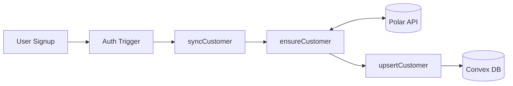
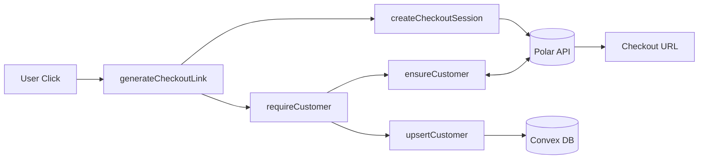
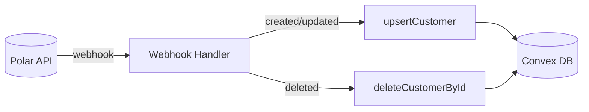

# Nakafa

[](https://deepwiki.com/nakafaai/nakafa.com)

## Overview

**Nakafa** is an open-source educational platform providing structured learning content across multiple educational levels (elementary, middle, high school, university) with political analysis articles.

**Live Site**: [nakafa.com](https://nakafa.com)

## Quick Start

### Prerequisites

- Node.js 18+
- pnpm
- Git

### Installation

```bash
# Clone & install
git clone https://github.com/nakafaai/nakafa.git
cd nakafa
pnpm install

# Start development
pnpm dev
```

Open [http://localhost:3000](http://localhost:3000)

### Available Scripts

```bash
pnpm dev          # Development server (Turbopack)
pnpm build        # Production build
pnpm start        # Production server
pnpm lint         # Lint & format check
pnpm test         # Run tests
pnpm clean        # Clean dependencies
```

## Architecture

### Customer Sync Flow (Convex + Polar)

The platform uses [Polar](https://polar.sh) for payments with bidirectional sync to Convex database.

#### Signup Flow



#### Checkout Flow



#### Webhook Flow



#### Flow Summary

| Flow | Trigger | Steps |
| ------ | --------- | ------- |
| **Signup** | User registers | Auth trigger → `syncCustomer` → `ensureCustomer` → `upsertCustomer` |
| **Checkout** | User clicks buy | `requireCustomer` → `createCheckoutSession` → Redirect to Polar |
| **Portal** | User opens settings | `requireCustomer` → `createCustomerPortalSession` → Redirect |
| **Webhook** | Polar event | `upsertCustomer` or `deleteCustomerById` |

#### Key Design Decisions

- **Polar is source of truth** - Local DB is cache for fast queries
- **Idempotent operations** - All mutations safe to retry
- **Race condition handling** - `ensureCustomer` retries on create failure
- **Edge case recovery** - Deleted from Polar → recreated on next checkout

## Development

### Project Documentation

Detailed technical documentation available on [DeepWiki](https://deepwiki.com/nakafaai/nakafa.com) - covers architecture, design decisions, and development patterns.

### Adding Content

1. Navigate to appropriate level in `packages/contents/subject/`
2. Create MDX files following existing structure
3. Update data files in `_data/` directories
4. Test locally with `pnpm dev`

### Testing

All tests use **Vitest** with jsdom environment and **global test functions** (no imports needed).

#### Getting Started

```bash
# Run all tests
pnpm test

# Test specific app
pnpm --filter www test
```

#### Test Commands

| Command | Description |
| --------- | ------------- |
| `pnpm test` | Run all tests across all apps/packages |
| `pnpm --filter www test` | Run tests for www app only |
| `pnpm --filter www test:watch` | Watch mode - re-run on file changes |
| `pnpm --filter www test:ui` | Open Vitest UI in browser |
| `pnpm --filter www test:coverage` | Run tests with coverage report |

#### Coverage

Coverage reports are generated in terminal and HTML format:

- Thresholds: 60% lines/functions, 50% branches, 60% statements
- HTML report: `apps/www/coverage/index.html`
- View locally after running `pnpm --filter www test:coverage`

#### Writing Tests

Tests are located in `**/__tests__/` or `**/*.test.ts|tsx` files.

**Example test file:**

```typescript
import { describe, expect, it } from "vitest";
import { getInitialName } from "./helper";

describe("getInitialName", () => {
  it("returns 'NF' for undefined", () => {
    expect(getInitialName()).toBe("NF");
  });

  it("returns initials for full name", () => {
    expect(getInitialName("John Doe")).toBe("JD");
  });
});
```

#### Best Practices

- **Test location**: Place tests next to source files in `__tests__/` directory
- **One test file per source file**: Use descriptive names matching the source
- **Arrange-Act-Assert**: Structure each test clearly
- **Test behavior, not implementation**: Focus on what the function does
- **Use globals**: No need to import `describe`, `it`, `expect` from vitest
- **Mock external dependencies**: Use setup file for common mocks

#### Test Setup

Common mocks for Next.js routing, i18n, and browser APIs are pre-configured in `packages/testing/setup.ts`:

- `useRouter()` - Mocked router with all methods
- `usePathname()` - Returns `/`
- `useSearchParams()` - Returns empty URLSearchParams
- `useTranslations()` - Returns key as translation
- `matchMedia()` - Mocked MediaQueryList

### Contributing

1. Fork repository
2. Create feature branch: `git checkout -b feature/name`
3. Make changes following established patterns
4. Run `pnpm lint` and `pnpm test`
5. Submit pull request

## License

**AGPL-3.0** - Copyleft license requiring source disclosure for network use.

For commercial licensing inquiries: <nakafaai@gmail.com>

## Contact

**Nabil Fatih** - [@nabilfatih](https://twitter.com/nabilfatih_) - <nakafaai@gmail.com>

---

Built with ❤️ for learners everywhere
