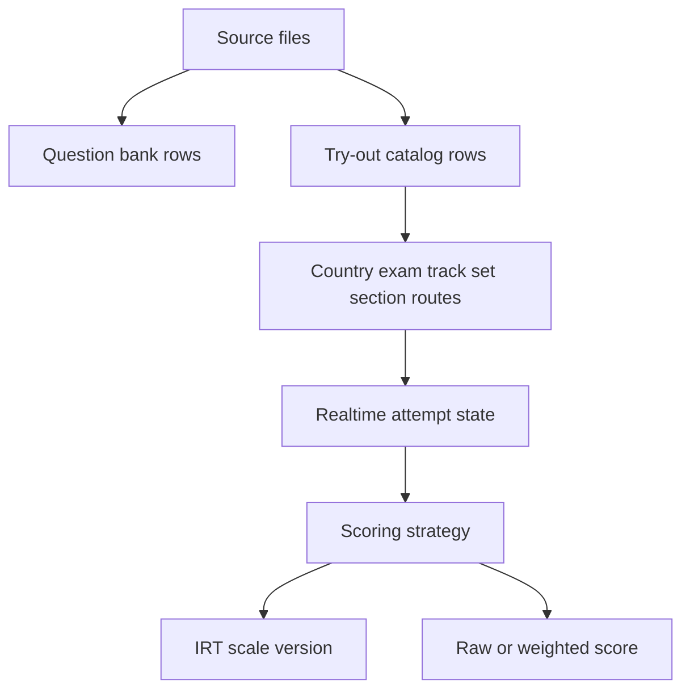

# ADR 0003: Try-Out Country And Exam Architecture

## Status

Accepted. Amended on 2026-07-08 to insert the canonical try-out track layer and
on 2026-07-22 to define freemium attempt access.

## Context

Nakafa try-out used to share public practice and exercise vocabulary with content routes. That made SNBT-specific data, product keys, runtime slug parsing, and part/package wording leak across the app, AI, Convex, and sync code.

The product direction is country-first try-out discovery:

- Indonesia contains exams such as SNBT and TKA.
- Germany can later contain exams such as Abitur and Studienkolleg.
- The same runtime must support IRT and non-IRT scoring strategies.
- Convex remains the realtime app-data source for attempts, responses, scores, access, and live read models.

## Decision

Use one try-out route grammar:

```text
/[locale]/try-out/[country]/[exam]/[track]/[set]/[section]
```

Use stable exam-family keys without yearly suffixes. For example, use `snbt` and `tka`, not `snbt-2026` or `tka-2026`. Model year, subject, or future exam-offer groupings as try-out tracks between exam and set.

Move authored try-out source to country and exam folders:

```text
packages/contents/tryout/[country]/[exam]
packages/contents/question-bank/tryout/[country]/[exam]
```

Use these Convex table families:

- `questionSets`, `questions`, `questionChoices` for immutable source-backed question bank rows.
- `tryoutCountries`, `tryoutExams`, `tryoutTracks`, `tryoutSets`, `tryoutSections` for public catalog routes.
- `tryoutAttempts`, `tryoutSectionAttempts`, `tryoutAttemptPlacements`, `tryoutResponses`, `tryoutScores` for realtime runtime state.
- `tryoutAccessCampaigns`, `tryoutAccessTargets`, `tryoutAccessLinks`, `tryoutAccessGrants`, `tryoutEntitlements` for premium access.
- `tryoutFreeAttemptClaims` for the one lifetime free attempt claimed by each account.
- `irtCalibration*` and `irtScale*` for scoring calibration and immutable scale versions.

### Freemium Access

Every account can start one complete try-out for free. The claim is global to the
account, not one claim per exam, track, or set. Starting through a live
subscription, competition grant, or access pass does not consume it.

The start mutation is authoritative. It resumes a live attempt before checking
new access, then resolves premium access before the free claim. A successful free
start inserts the claim and attempt in the same transaction, so a failed start
consumes nothing and concurrent starts cannot create two free attempts. The
catalog access query is advisory UI state only; a structured
`TRYOUT_ACCESS_REQUIRED` mutation failure opens the upgrade dialog instead of a
generic retry error.

The free claim is durable account state. Content and try-out reset commands must
preserve it, while deleted-user cleanup removes it with the local user row.
Attempts record the access source used at creation for support, analytics, and
future policy changes.

Delete public standalone practice/exercise routes and tool surfaces. Do not keep aliases, compatibility readers, or old product/package/part vocabulary in touched code.

## Flow



## Convex Reset Rule

Convex schemas validate only tables listed in the schema. Removing a table from the code schema does not delete old deployed tables automatically. Legacy deployed tables such as `exerciseAnswers`, `exerciseAttempts`, `exerciseChoices`, `exerciseItemParameters`, `exerciseQuestions`, `exerciseSets`, and old event try-out tables must be deleted only after backup.

Chat tables are outside the try-out reset boundary. A chat table rename requires
its own backed-up, validated data migration before the old table is removed.

Backup commands:

```sh
CI=true pnpm --dir packages/backend exec convex export --include-file-storage --path /tmp/nakafa-convex-dev-before-tryout-reset.zip
CI=true pnpm --dir packages/backend exec convex export --prod --include-file-storage --path /tmp/nakafa-convex-prod-before-tryout-reset.zip
```

After the PR code is deployed and the new sync has populated the new tables, delete legacy deployment tables from the Convex dashboard data page. Do not add permanent cleanup functions for old table names.

## Consequences

- The public practice/exercise pages are intentionally removed.
- The app has one try-out vocabulary from source to Convex to UI.
- Attempt routes can scale by indexed catalog and attempt tables instead of route parsing or unbounded scans.
- Exam pages list tracks, and track pages paginate ready sets through indexed Convex read models.
- Old direct exam-to-set URLs are intentionally not supported.
- IRT is a strategy under try-out scoring, not an SNBT-only subsystem.
- Backward compatibility is intentionally not supported for removed practice/exercise URLs.
