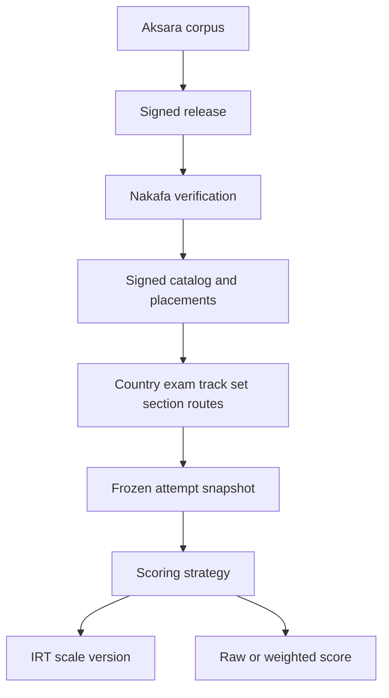

# ADR 0003: Try-Out Country And Exam Architecture

## Status

Accepted. Amended on 2026-07-08 to insert the canonical try-out track layer,
on 2026-07-22 to define freemium attempt access, and on 2026-08-04 to make
Aksara signed publication the only authored try-out source.

## Context

Nakafa try-out used to share public practice and exercise vocabulary with content routes. That made SNBT-specific data, product keys, runtime slug parsing, and part/package wording leak across the app, AI, Convex, and sync code.

The product direction is country-first try-out discovery:

- Indonesia contains exams such as SNBT and TKA.
- Germany can later contain exams such as Abitur and Studienkolleg.
- The same runtime must support IRT and non-IRT scoring strategies.
- Convex remains the realtime app-data source for attempts, responses, scores, access, and live read models.

## Decision

Use one try-out route grammar:

```text
/[locale]/try-out/[country]/[exam]/[track]/[set]/[section]
```

Use stable exam-family keys without yearly suffixes. For example, use `snbt` and `tka`, not `snbt-2026` or `tka-2026`. Model year, subject, or future exam-offer groupings as try-out tracks between exam and set.

Keep authored try-out source only in Aksara country and exam folders:

```text
aksara/packages/corpus/tryout/[country]/[exam]
aksara/packages/corpus/question-bank/tryout/[country]/[exam]
```

Aksara canonicalizes catalog rows, placements, protected question and answer
artifacts, renderer metadata, and release metadata into one signed publication.
Nakafa verifies the signature, canonical hashes, complete snapshot digests, and
release transition before any publication write.

Use these Convex table families:

- `contentReleases`, `contentSnapshots`, `tryoutCatalog`, and
  `tryoutPlacements` for verified signed publication state.
- `tryoutAttempts`, `tryoutSectionAttempts`, `tryoutAttemptPlacements`, `tryoutResponses`, `tryoutScores` for realtime runtime state.
- `tryoutAccessCampaigns`, `tryoutAccessTargets`, `tryoutAccessLinks`, `tryoutAccessGrants`, `tryoutEntitlements` for premium access.
- `tryoutFreeAttemptClaims` for the one lifetime free attempt claimed by each account.
- `irtCalibration*` and `irtScale*` for scoring calibration and immutable scale versions.

Do not reconstruct authored catalog or question data from Nakafa filesystem
copies. Do not add a second authored table family beside the signed snapshot.

### Freemium Access

Every account can start one complete try-out for free. The claim is global to the
account, not one claim per exam, track, or set. Starting through a live
subscription, competition grant, or access pass does not consume it.

The start mutation is authoritative. It resumes a live attempt before checking
new access, then resolves premium access before the free claim. A successful free
start inserts the claim and attempt in the same transaction, so a failed start
consumes nothing and concurrent starts cannot create two free attempts. The
catalog access query is advisory UI state only; a structured
`TRYOUT_ACCESS_REQUIRED` mutation failure opens the upgrade dialog instead of a
generic retry error.

The free claim is durable account state. Content and try-out reset commands must
preserve it, while deleted-user cleanup removes it with the local user row.
Attempts record the access source used at creation for support, analytics, and
future policy changes.

Delete public standalone practice/exercise routes and tool surfaces. Do not keep aliases, compatibility readers, or old product/package/part vocabulary in touched code.

## Flow


```mermaid
flowchart TD
  Source["Aksara corpus"]
  Release["Signed release"]
  Verify["Nakafa verification"]
  Catalog["Signed catalog and placements"]
  Route["Country exam track set section routes"]
  Attempt["Frozen attempt snapshot"]
  Score["Scoring strategy"]
  IRT["IRT scale version"]
  Raw["Raw or weighted score"]

  Source --> Release
  Release --> Verify
  Verify --> Catalog
  Catalog --> Route
  Route --> Attempt
  Attempt --> Score
  Score --> IRT
  Score --> Raw
```

## Convex Reset Rule

Content reset may delete only rebuildable Nakafa read models. It preserves
signed snapshot state, attempts, progress, placements, responses, scores,
access state, entitlements, free claims, calibration runs, and IRT scales.
Attempts and scales retain the exact signed snapshot needed for historical
review and scoring.

Removing a retired deployment table requires three separate proofs: its row
count is zero, no schema or code reference remains, and the replacement runtime
passes acceptance. Remove the schema first, deploy it, then permanently delete
the empty table through the Convex dashboard. Do not add permanent cleanup
functions for retired table names.

## Consequences

- The public practice/exercise pages are intentionally removed.
- The app has one try-out vocabulary from source to Convex to UI.
- Attempt routes use verified signed catalog indexes instead of route parsing or unbounded scans.
- Exam pages list tracks, and track pages paginate ready sets through indexed Convex read models.
- Old direct exam-to-set URLs are intentionally not supported.
- IRT is a strategy under try-out scoring, not an SNBT-only subsystem.
- Backward compatibility is intentionally not supported for removed practice/exercise URLs.
- Content reset cannot erase durable try-out history or access state.
