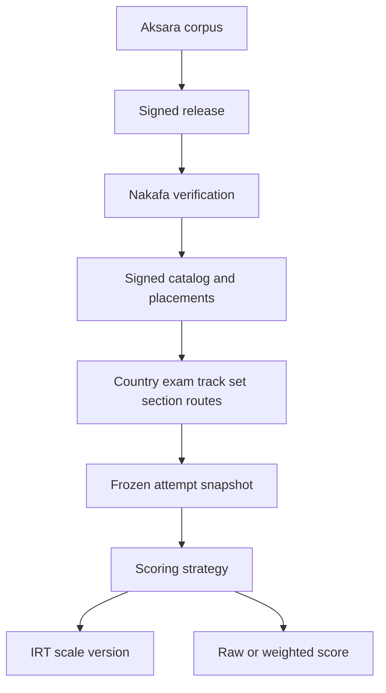

# ADR 0003: Try-Out Country And Exam Architecture

## Status

Accepted. Amended on 2026-07-08 to insert the canonical try-out track layer,
on 2026-07-22 to define freemium attempt access, and on 2026-08-04 to make
Aksara signed publication the only authored try-out source. Amended on
2026-08-10 to define transactional response and scoring integrity. Amended on
2026-08-14 to record the completed physical retirement of superseded storage,
on 2026-09-01 to define the structured response rollout, and on 2026-09-19
to make attempts and scores free with Pro access to worked solutions.

## Context

Nakafa try-out used to share public practice and exercise vocabulary with content routes. That made SNBT-specific data, product keys, runtime slug parsing, and part/package wording leak across the app, AI, Convex, and sync code.

The product direction is country-first try-out discovery:

- Indonesia contains exams such as SNBT and TKA.
- Germany can later contain exams such as Abitur and Studienkolleg.
- The same runtime must support IRT and non-IRT scoring strategies.
- Convex remains the realtime app-data source for attempts, responses, scores, access, and live read models.

## Decision

Use one try-out route grammar:

```text
/[locale]/try-out/[country]/[exam]/[track]/[set]/[section]
```

Use stable exam-family keys without yearly suffixes. For example, use `snbt` and `tka`, not `snbt-2026` or `tka-2026`. Model year, subject, or future exam-offer groupings as try-out tracks between exam and set.

Keep authored try-out source only in Aksara country and exam folders:

```text
aksara/packages/corpus/tryout/[country]/[exam]
aksara/packages/corpus/question-bank/tryout/[country]/[exam]
```

Aksara canonicalizes catalog rows, placements, protected question and answer
artifacts, renderer metadata, and release metadata into one signed publication.
Nakafa verifies the signature, canonical hashes, complete snapshot digests, and
release transition before any publication write.

Use these Convex table families:

- `contentReleases`, `contentSnapshots`, `tryoutCatalog`, and
  `tryoutPlacements` for verified signed publication state.
- `tryoutAttempts`, `tryoutSectionAttempts`, `tryoutAttemptPlacements`, `tryoutResponses`, `tryoutScores` for realtime runtime state.
- `tryoutAccessCampaigns`, `tryoutAccessTargets`, `tryoutAccessLinks`, `tryoutAccessGrants`, `tryoutEntitlements` for premium access.
- `irtCalibration*` and `irtScale*` for scoring calibration and immutable scale versions.

Do not reconstruct authored catalog or question data from Nakafa filesystem
copies. Do not add a second authored table family beside the signed snapshot.

### Runtime Integrity

One domain response transaction receives one frozen placement ID and exactly one
learner selection. A selection is empty, one option, an ordered option set, or an
ordered category assignment, according to the placement's frozen
`responseSpec`. The server derives elapsed time from the active section timer and
evaluates correctness from that immutable specification. The transaction
validates attempt, section, placement, response kind, and response ownership
before it updates the response and parent activity counters.

The structured-response rollout completed on 2026-09-01 after production data
contained only canonical rows. Placements persist one required `responseSpec`,
learner responses persist one required `selection` and `isComplete` result, and
the public mutation accepts only that stable contract. Single-choice,
multiple-choice, and category responses share this model without rollout
adapters or duplicate runtime projections.

The runtime exposes only exact attempt-ID
state, response, history, and page operations. Public-path compatibility
queries, fallback indexes, and duplicate state shapes are not supported.

Retained attempts read their immutable signed catalog, placement, artifact,
release, renderer, and snapshot bytes through the same canonical contracts as
active content. Historical review preserves the authored content, responses, and scoring data
frozen at attempt start. It authenticates their stored signed identities and
fails closed when those bytes violate the canonical contract. Historical decoders, fallback transformations, and separate recovery
projection contracts are not supported.

Section completion, attempt completion, and expiry load bounded indexed
placement and response graphs. They reject missing, duplicate, or mismatched
snapshot identities before persistence. Terminal IRT scoring loads one
validated placement inventory and score source, then reuses both for section
and attempt results so maximum-size placements are not read twice in one
transaction.

Current attempt pages resolve the latest attempt through the one compact,
indexed progress row, then fail closed unless its duplicated identity, attempt
number, status, status rank, and latest attempt row agree. Historical review
pages continue to render their stored immutable snapshot.
Restart actions and retained-route destinations resolve separately from the
active signed catalog in the same Convex query transaction, so a catalog rename
or entry revision cannot silently change the frozen review or send a new attempt
to an obsolete route.

The web bootstraps that exact attempt page, then subscribes only to
`getSetAttemptState` or `getSectionAttemptState` while the attempt can still
change. Frozen display stays separate from the active signed restart and
navigation destinations. Terminal pages stop their mutable subscriptions.

### Freemium Access

Every authenticated account can start and repeat any try-out without a lifetime
claim or a per-set attempt cap. Every completed attempt retains its score,
including IRT scores on supported sets. The start mutation resumes a live attempt
before starting another and derives the next attempt number from the newest
indexed attempt, without scanning the complete history.

Response capture and IRT scoring do not filter by subscription plan. More free
attempts can therefore contribute response data, but response volume alone does
not calibrate the model. The current scale publisher reuses matching item
parameters or starts a provisional 2PL scale; it does not fit new parameters
automatically from accumulated responses. Scores retain their scale status.

Nakafa Pro grants access to worked solutions and answer keys after an attempt
finishes. The billing-owned `users.plan` is the current entitlement, maintained
transactionally by the subscription trigger. Upgrading opens solutions for
previous attempts too. Downgrading revokes future solution reads while preserving
attempts and scores. An access-source snapshot records the circumstances of a
start for competition eligibility and attribution; it does not grant permanent
access to solutions.

Both the runtime response projection and the signed-body query enforce the same
current-plan check. Free terminal responses omit answer keys and answer selectors.
A direct request for an answer artifact must pass ownership, terminal lifecycle,
and current Pro entitlement checks. The user interface presents the upgrade
option below the free result.

Delete public standalone practice/exercise routes and tool surfaces. Do not keep aliases, compatibility readers, or old product/package/part vocabulary in touched code.

## Flow



## Convex Reset Rule

Content reset may delete only rebuildable Nakafa read models. It preserves
signed snapshot state, attempts, progress, placements, responses, scores,
access state, entitlements, calibration runs, and IRT scales.
Attempts and scales retain the exact signed snapshot needed for historical
review and scoring.

Removing a retired deployment table requires three separate proofs: its row
count is zero, no schema or code reference remains, and the replacement runtime
passes acceptance. Drain rows through one temporary bounded internal operation,
prove every retired table empty, then remove both the operation and schemas in
the final deployment. Do not retain permanent cleanup functions for retired
table names.

### Completed Physical Retirement

On production deployment `dapper-antelope-269`, an authenticated Convex
Dashboard operator deleted the following 27 superseded physical tables between
`2026-08-14T16:00:03.363Z` and `2026-08-14T16:05:00.981Z`:

- Legacy content: `articleReferences`, `contentAuthors`, `articleContents`,
  `authors`, `curriculumLessons`, `curriculumTopics`, `quranVerses`,
  `quranSurahs`, `contentRoutes`, `contentRoutePages`, `contentRouteCounts`,
  `publicRouteSitemapCounts`, `publicRouteSitemapPages`, `publicRoutes`,
  `publicRouteSyncState`, and `contentSearch`.
- Retired learning plans: `learningProgramCoverage`,
  `learningProgramSources`, `learningPrograms`, `learningPlanItems`,
  `learningPlans`, and `learningProfiles`.
- Retired audio generation: `audioContentSources`, `contentAudios`, and
  `audioGenerationQueue`.
- Retired signed ownership: `contentOwners` and `materialOwners`.

Immediately before each deletion, the table was independently reproved
undeclared and empty, and its Dashboard page also reported it empty. After the
final deletion, the production table inventory reported `remaining=0` for all
27 names. Public WWW, API, and MCP acceptance remained HTTP 200, and the latest
1,000 Convex events contained zero failures or errors. This section records
historical completion evidence only; it is not a reusable migration inventory
or runtime compatibility contract.

## Consequences

- The public practice/exercise pages are intentionally removed.
- The app has one try-out vocabulary from source to Convex to UI.
- Attempt routes use verified signed catalog indexes instead of route parsing or unbounded scans.
- Exam pages list tracks, and track pages paginate ready sets through indexed Convex read models.
- Old direct exam-to-set URLs are intentionally not supported.
- IRT is a strategy under try-out scoring, not an SNBT-only subsystem.
- Backward compatibility is intentionally not supported for removed practice/exercise URLs.
- Content reset cannot erase durable try-out history or access state.
