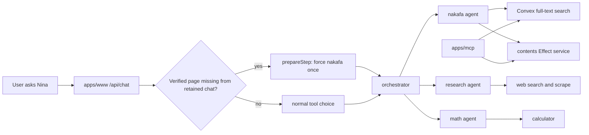
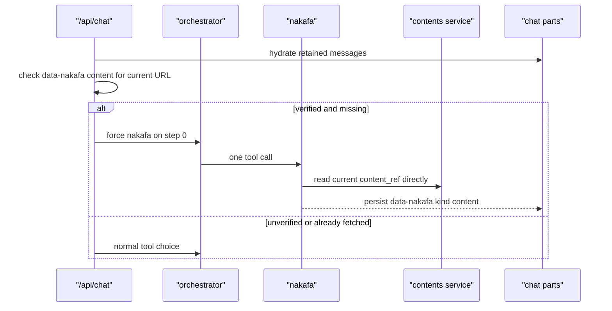

# Nina Agent Architecture

Nina has one chat route, one orchestrator, and three specialist agents. Nakafa
content reading is owned by `packages/contents`; Nakafa discovery is served by
the Convex `contentSearch` read model written during content sync.

## Flow

## Current Page

## Contracts

- `packages/contents/_lib/agent` owns `read`, `exercise`, `quran`, `taxonomy`,
  and `verify`.
- Convex owns runtime search through `contentSearch`.
- Nina and MCP use the same search result contract.
- Nina stores one UI data envelope: `data-nakafa`.
- `data-nakafa.kind` decides the renderer: `search`, `content`, `exercise`,
  `quran`, or `taxonomy`.
- Current-page fetch is deterministic through AI SDK `prepareStep`, `toolChoice`,
  and `activeTools`.

## References

- AI SDK `prepareStep`: https://ai-sdk.dev/docs/ai-sdk-core/tools-and-tool-calling#preparestep-callback
- Convex full-text search: https://docs.convex.dev/search/text-search
- Effect services: https://effect.website/docs/requirements-management/services/
