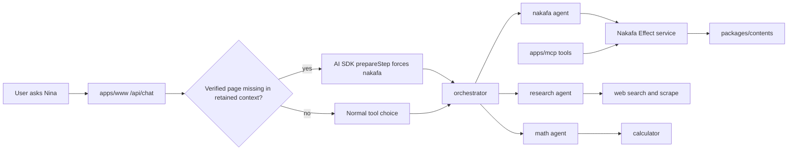
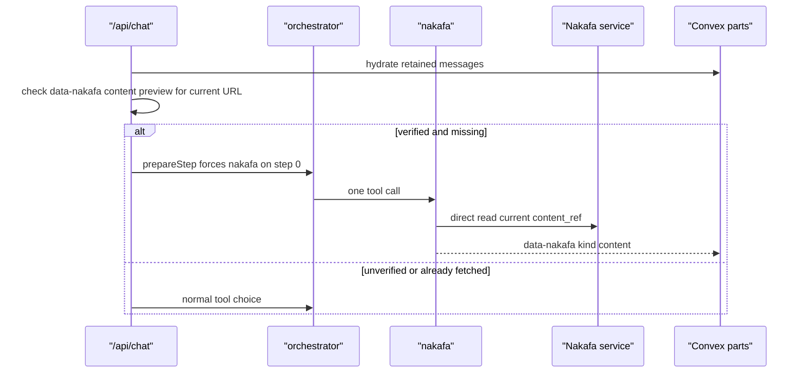

# Nina Agent Architecture

Nina has one chat route, one orchestrator, and three specialist agents. Nakafa
content is owned by `packages/contents/_lib/agent/service.ts`, so MCP and Nina
read the same contract.

## Flow

## Current Page

## Contracts

- `Nakafa.search`, `read`, `exercise`, `quran`, `taxonomy`, and `verify` are
  Effect service methods.
- MCP tools call the same service methods as Nina.
- Nina stores one UI data envelope: `data-nakafa`.
- `data-nakafa.kind` decides the renderer: `search`, `content`, `exercise`,
  `quran`, or `taxonomy`.
- Convex persists `tool-nakafa` and `data-nakafa` with explicit validators.
- Current-page fetch is deterministic through AI SDK `prepareStep`, `toolChoice`,
  and `activeTools`.

## References

- AI SDK `prepareStep`: https://ai-sdk.dev/docs/ai-sdk-core/tools-and-tool-calling#preparestep-callback
- Effect services: https://effect.website/docs/requirements-management/services/
- Convex validators: https://docs.convex.dev/functions/validation
