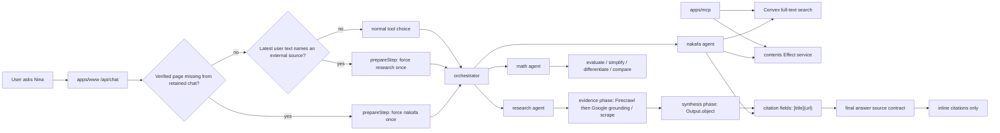
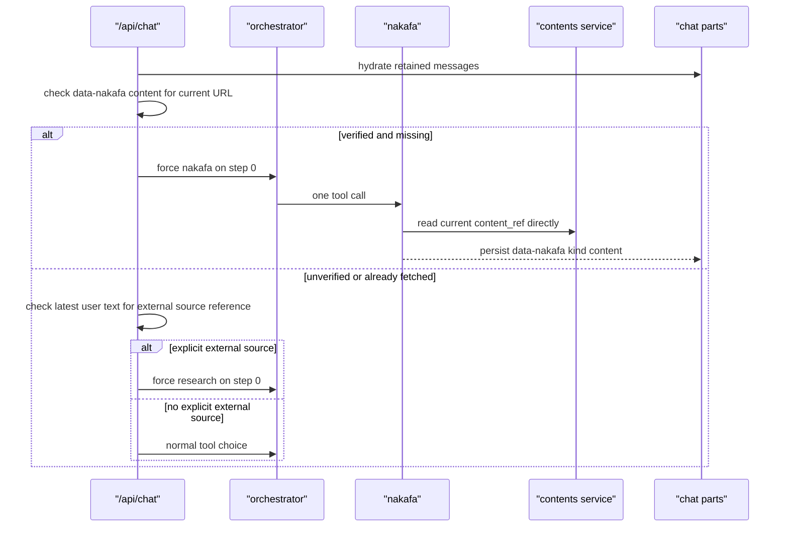

# Nina Agent Architecture

Nina has one chat route, one orchestrator, and three specialist agents. Nakafa
content reading is owned by `packages/contents`; Nakafa discovery is served by
the Convex `contentSearch` read model written during content sync.

## Flow

## Docs Map

- [Research citation flow](./research-citations.md)
- [Query-scoped search UI](./query-scoped-search.md)
- [Math evidence scope](./math-evidence.md)

When an agent flow changes, update the closest doc here or add a small focused
doc. Prefer diagrams over long prose so each file stays skimmable.

## Current Page

## Contracts

- `packages/contents/_lib/agent` owns `read`, `exercise`, `quran`, `taxonomy`,
  and `verify`.
- Convex owns runtime search through `contentSearch`.
- Nina and MCP use the same search result contract.
- Nina stores one UI data envelope: `data-nakafa`.
- `data-nakafa.kind` decides the renderer: `search`, `content`, `exercise`,
  `quran`, or `taxonomy`.
- Search UI parts are query-scoped: one executed query writes one loading part
  and reconciles that same part to done or error.
- Research runs Firecrawl first for inspectable source rows, then Google Search
  grounding for corroboration when grounding metadata is available.
- Provider identity is stored for traces and debugging, but the chat UI only
  shows user-relevant queries and sources.
- Specialist evidence exposes citation links beside the facts they support.
- Final answers cite sources inline only; terminal source/reference sections are
  not part of the user-facing contract.
- Math evidence carries both check status and derivation scope. A verified
  partial check is not a fully verified final derivation.
- Current-page fetch is deterministic through AI SDK `prepareStep`, `toolChoice`,
  and `activeTools`.
- Explicit external source references are extracted by `@repo/ai/lib/source`.
  Routing uses them to enter research, and research receives the full ordered
  source list for exact-source reading.

## References

- AI SDK `prepareStep`: https://ai-sdk.dev/docs/ai-sdk-core/tools-and-tool-calling#preparestep-callback
- Convex full-text search: https://docs.convex.dev/search/text-search
- Effect services: https://effect.website/docs/requirements-management/services/
