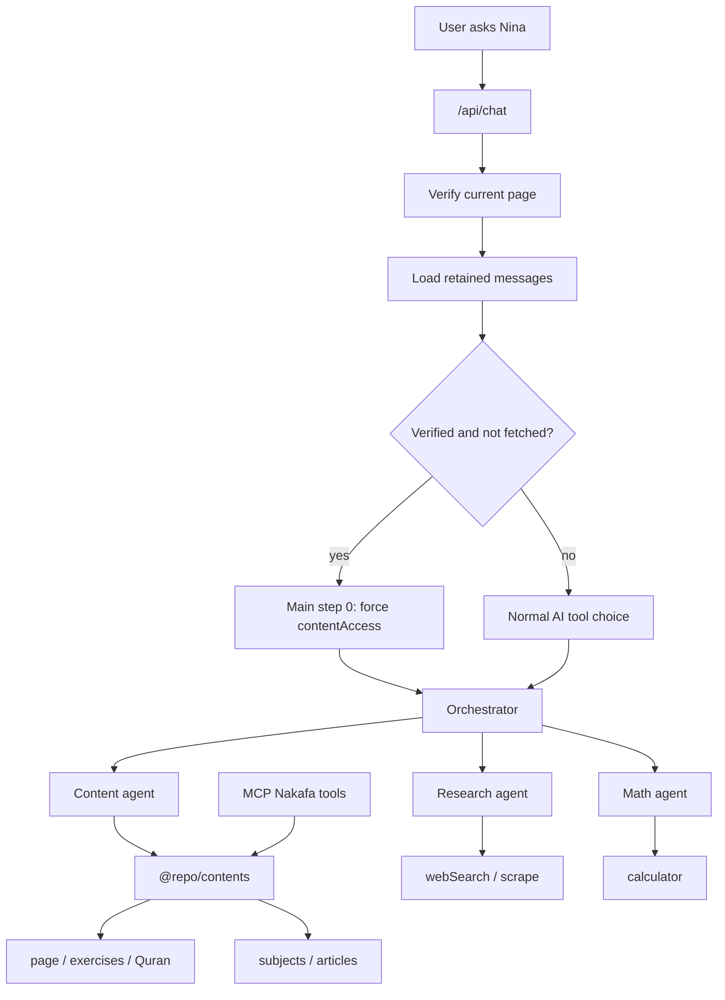
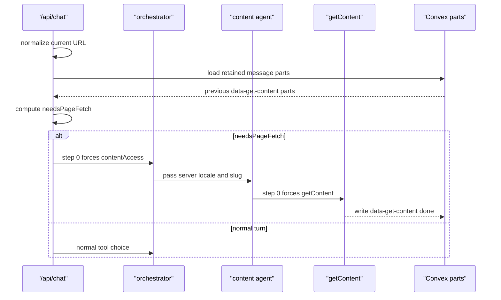

# Nina Agent Architecture

This document explains how Nina routes one chat turn through the AI agents, how
current-page content is fetched deterministically, and which files own each
decision.

It is a map for engineering, support, and product debugging. The code remains
the source of truth.

## References

- AI SDK tool calling:
  `packages/ai/node_modules/ai/docs/03-ai-sdk-core/15-tools-and-tool-calling.mdx`
- Effect patterns:
  `nakafa.com/.agents/skills/effect-best-practices/SKILL.md`
- Chat route: `apps/www/app/api/chat/route.ts`
- MCP Nakafa tools: `apps/mcp/lib/mcp/server.ts`
- Shared content agent APIs: `packages/contents/_lib/agent/`
- Convex chat part persistence:
  `packages/backend/convex/chats/messageParts/uiToDb.ts`
- Convex chat part hydration:
  `packages/backend/convex/chats/messageParts/dbToUi.ts`

## Summary

Nina has two layers:

- `/api/chat` owns request validation, page verification, chat persistence, and
  the decision to fetch the current page.
- `packages/ai/agents` owns agent execution after the route has made that
  decision.

The important rule:

> If the user is on a verified content page and the retained chat context does
> not already contain a successful fetch for that page, the first AI step must
> call `contentAccess`, and the first content-agent step must call `getContent`.

This is deterministic because the route and content agent use AI SDK
`prepareStep`, `toolChoice`, and `activeTools`. It is not prompt-dependent.

## Main Components

| Component | Responsibility |
| --- | --- |
| `/api/chat/route.ts` | validate request, authenticate, verify page, load messages, start stream |
| `/api/chat/content.ts` | decide whether the current page still needs a fetch |
| `/api/chat/step.ts` | force `contentAccess` for main step `0` when needed |
| `/api/chat/stream.ts` | create the AI SDK stream and orchestrator tools |
| `agents/orchestrator/` | expose top-level tools: content, research, math |
| `agents/content/` | retrieve Nakafa content from `@repo/contents` |
| `apps/mcp/` | expose the same Nakafa content surface to MCP clients |
| `agents/research/` | search and scrape external web sources |
| `agents/math/` | run calculator work |
| `backend/convex/chats/messageParts/` | persist and hydrate AI SDK message parts |

## End To End Flow

## Deterministic Current-Page Fetch

The route computes `needsPageFetch` after loading and compressing the retained
messages.

It returns `true` only when all of these are true:

- the current URL is verified by the server
- the retained message context does not already contain `data-get-content`
- that retained `data-get-content` is not `done` for the normalized current URL

`loading` and `error` parts do not block another fetch. They are incomplete
work, so the next turn can retry.

## Why There Is No Second Content Tool

`getContent` already fetches Nakafa material by locale and slug. A separate
current-page tool would duplicate behavior and make persisted chat history more
confusing.

Instead, the first forced `getContent` call uses server-derived input:

- `locale` comes from the `/api/chat` request after validation
- `slug` comes from the current page context
- model-provided input is ignored only for that one required page fetch

After that first call, `getContent` behaves normally again.

## Duplicate Policy

Duplicate prevention is scoped to the retained chat context.

Nina fetches the same verified page again only when the old successful
`data-get-content` part is no longer retained after message compression.

This keeps follow-up questions cheap while still recovering correctly when old
context has been trimmed.

## Persistence Contract

Convex does not need a schema change for deterministic page fetch.

The existing persisted parts are already enough:

- `tool-contentAccess` records the top-level orchestrator tool call
- `data-get-content` records content fetch state and URL

The route only reads retained hydrated UI parts. It does not need a separate
database marker.

## MCP Parity

MCP already treats Nakafa content as a first-class content surface:

- search Nakafa content
- fetch a content page
- fetch taxonomy
- fetch one exercise
- fetch Quran references

Nina reads `@repo/contents` directly, so the runtime dependency graph is aligned
with MCP. The next architectural cleanup is to make Nina's content agent use the
same `packages/contents/_lib/agent/` contract that MCP uses, so search and
retrieval behavior cannot drift.

Renaming `contentAccess` to a better name, such as a Nakafa agent, should be a
separate migration. Convex persists `tool-contentAccess`, so a rename needs an
intentional compatibility plan for old chat parts instead of a hidden schema
change inside this refactor.

## Effect Boundary

Effect is used inside route helpers, agent steps, tool execution, and repair
logic so the flow stays typed and traceable.

Promise boundaries stay at framework or AI SDK edges:

- `POST` remains a Next.js route handler
- AI SDK `execute` callbacks return promises
- `streamText` repair callbacks return promises

Inside those boundaries, helpers are plain `Effect.fn` programs.

## Operational Checklist

When debugging a current-page content issue:

1. Verify `/api/chat` marks the page as `verified`.
2. Check retained messages for `data-get-content` with the normalized URL.
3. If no successful part exists, main step `0` should force `contentAccess`.
4. The content agent step `0` should force the existing `getContent` tool.
5. Convex should persist a final `data-get-content` part with `status: "done"`.

## Tests

Focused coverage lives next to the code it checks:

- `/api/chat/content.test.ts` covers normalized duplicate detection
- `/api/chat/step.test.ts` covers forced main-agent step settings
- `agents/content/step.test.ts` covers forced content-agent step settings
- `agents/content/tools/material/input.test.ts` covers server-derived page input

The `@repo/ai` Vitest config enforces `100%` coverage thresholds for the agent
tests.
