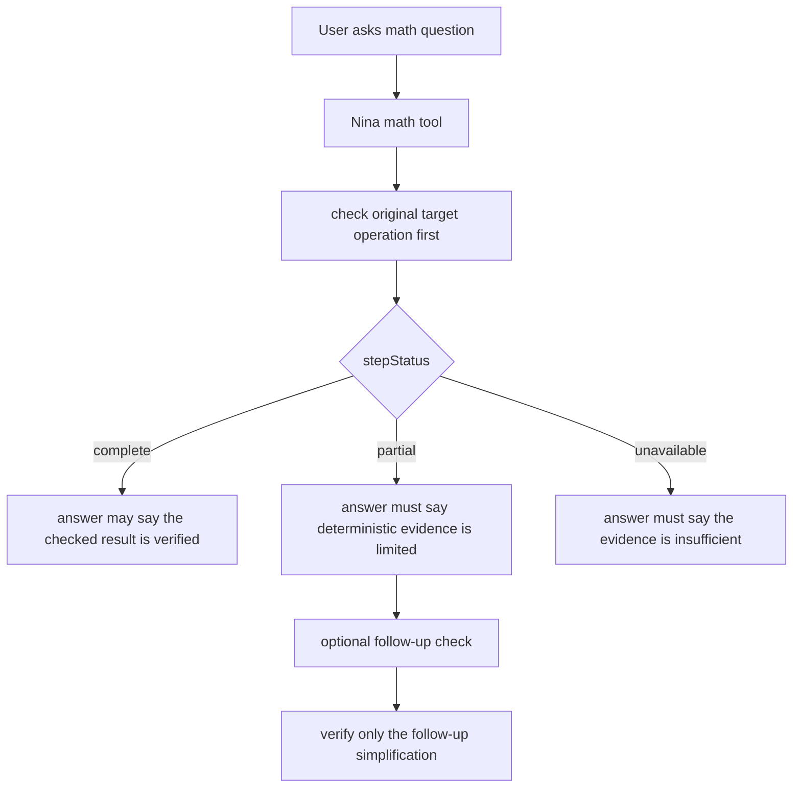
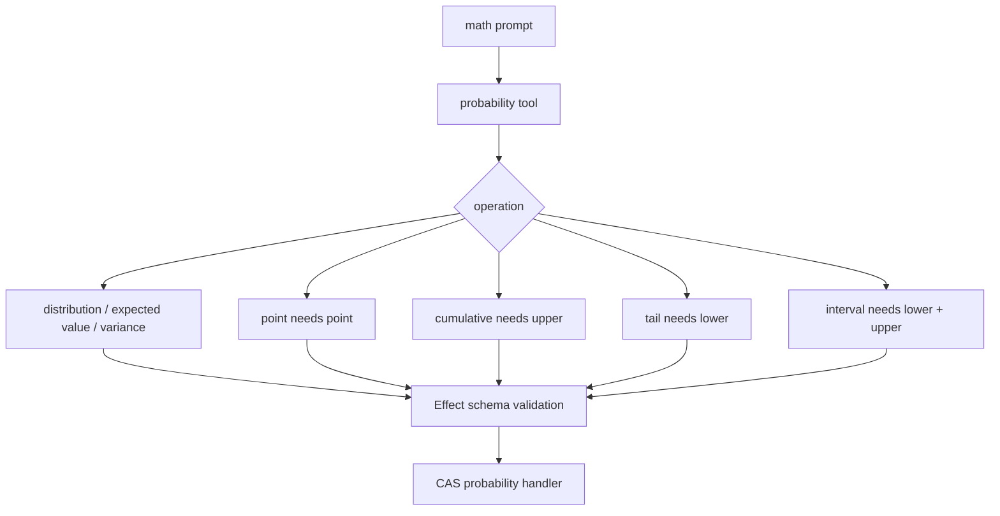
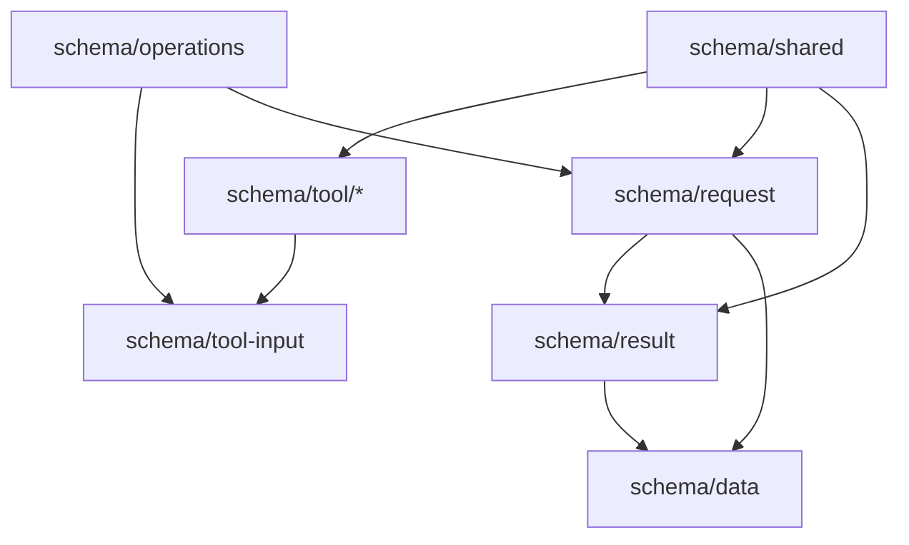

# Math Evidence Scope

Nina's math agent separates deterministic tool status from derivation scope.

Probability is one model-facing tool. Event-specific requirements stay behind
the Effect schema and CAS adapter so the prompt stays small while validation
remains strict.

The math package keeps schema ownership in focused modules instead of a single
large file. Callers import the exact schema they use; there is no `schema.ts`
barrel.

## Contracts

- Calculus requests use calculus before arithmetic simplification.
- Bounded integrals are described as definite or improper integrals, never
  indefinite integrals.
- Math schema imports are concrete module imports such as
  `@repo/math/schema/tool/probability`; `@repo/math/schema` is not a public
  compatibility barrel.
- Named probability distributions use one `probability` tool. The selected
  operation carries the event shape instead of exposing separate tool names for
  point, cumulative, tail, and interval probabilities.
- Partial evidence can support a result only when the answer names the theorem
  or transformation that supplies the missing derivation.
- A later arithmetic check verifies only the simplification it actually checked.
- Fair dice, cards, and finite equally likely outcomes use statistics mean or
  arithmetic over the outcome list instead of the named-distribution tool.

## References

- AI SDK tools: https://ai-sdk.dev/docs/ai-sdk-core/tools-and-tool-calling
- AI SDK prompt engineering: https://ai-sdk.dev/docs/ai-sdk-core/prompt-engineering
- Effect services: https://effect.website/docs/requirements-management/services/
