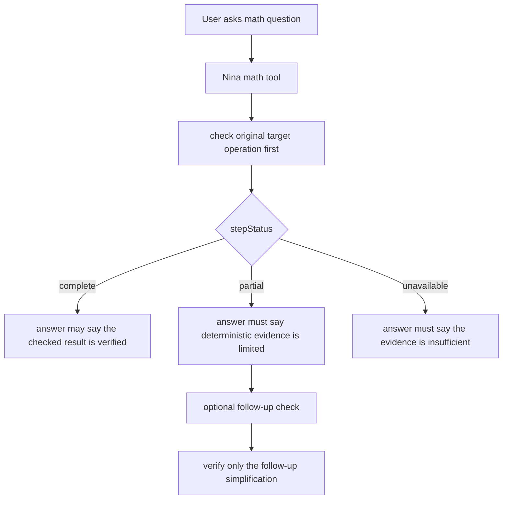

# Math Evidence Scope

Nina's math agent separates deterministic tool status from derivation scope.

## Contracts

- Calculus requests use calculus before arithmetic simplification.
- Bounded integrals are described as definite or improper integrals, never
  indefinite integrals.
- Partial evidence can support a result only when the answer names the theorem
  or transformation that supplies the missing derivation.
- A later arithmetic check verifies only the simplification it actually checked.
- Fair dice, cards, and finite equally likely outcomes use statistics mean or
  arithmetic over the outcome list instead of the named-distribution tool.

## References

- AI SDK tools: https://ai-sdk.dev/docs/ai-sdk-core/tools-and-tool-calling
- Effect services: https://effect.website/docs/requirements-management/services/
