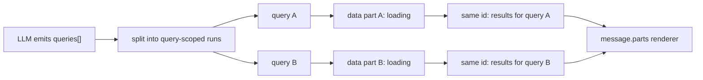
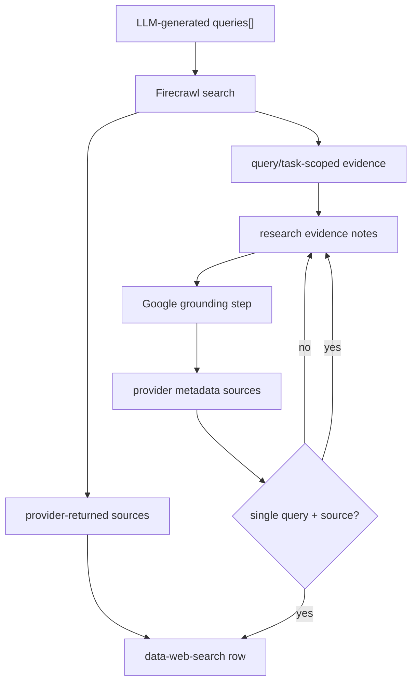
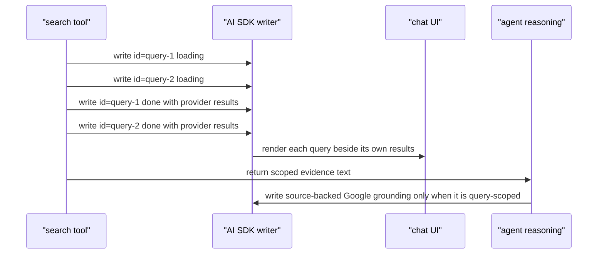

# Query-Scoped Search UI

Search tools keep query/result locality in the stream payload. The UI does not
rebuild grouping from flat arrays.

## Contracts

- `data-web-search` uses `queries: [query]` for each executed search run.
- `data-web-search.provider` is internal trace data only. The UI does not show
  provider names to users.
- `data-nakafa.kind === "search"` uses `input.queries: [query]` for each
  Convex-backed Nakafa search run.
- The same data-part id is used for loading and terminal state so AI SDK
  reconciliation updates the visible row in place.
- Firecrawl UI parts render provider-returned sources. Agent reasoning receives
  the filtered evidence set separately.
- Google grounding can expose provider-level queries and sources without a
  source-per-query mapping. Do not invent groupings when the provider does not
  return that relationship.
- Google grounding is rendered as a search row only when it has exactly one
  search query and at least one usable direct source URL. Query-only grounding
  remains in DevTools/provider metadata instead of the user-facing source UI.
  Multi-query grounding remains internal evidence because the provider does not
  expose which sources belong to which query.

## References

- AI SDK custom data streaming: https://ai-sdk.dev/docs/ai-sdk-ui/streaming-data
- AI SDK UI messages: https://ai-sdk.dev/docs/reference/ai-sdk-core/ui-message
