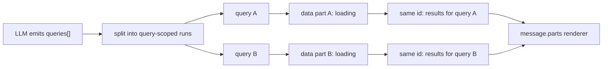
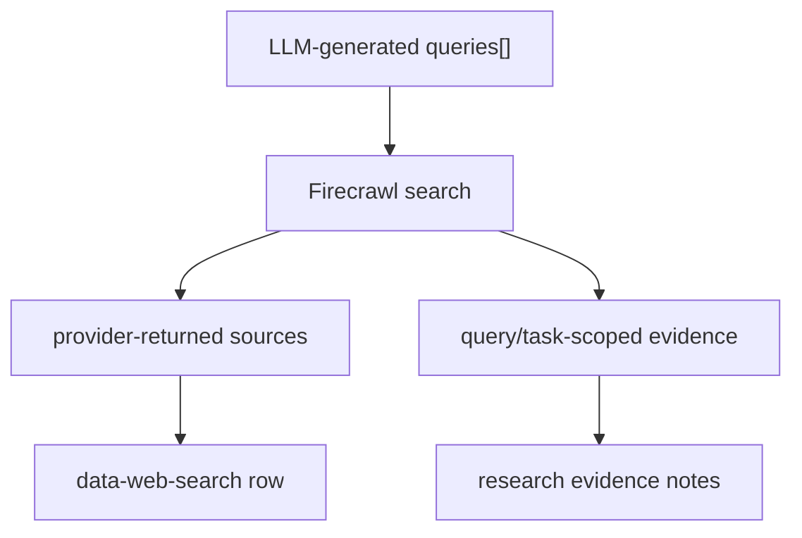
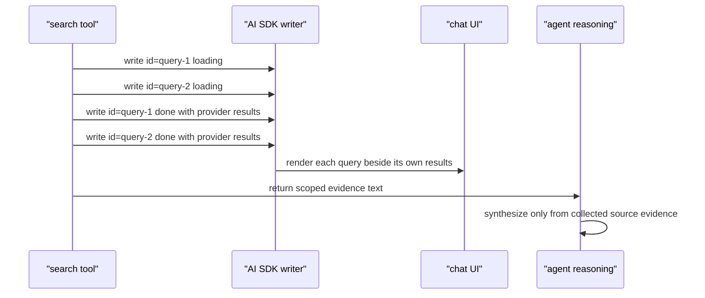

# Query-Scoped Search UI

Search tools keep query/result locality in the stream payload. The UI does not
rebuild grouping from flat arrays.

```mermaid
flowchart LR
  Model["LLM emits queries[]"] --> Split["split into query-scoped runs"]
  Split --> QueryA["query A"]
  Split --> QueryB["query B"]
  QueryA --> LoadingA["data part A: loading"]
  QueryB --> LoadingB["data part B: loading"]
  LoadingA --> DoneA["same id: results for query A"]
  LoadingB --> DoneB["same id: results for query B"]
  DoneA --> UI["message.parts renderer"]
  DoneB --> UI
```

## Contracts

- `data-web-search` uses `queries: [query]` for each executed search run.
- `data-web-search.provider` is internal trace data only. The UI does not show
  provider names to users.
- `data-nakafa.kind === "search"` uses `input.queries: [query]` for each
  Convex-backed Nakafa search run.
- The same data-part id is used for loading and terminal state so AI SDK
  reconciliation updates the visible row in place.
- Firecrawl UI parts render provider-returned sources. Agent reasoning receives
  the filtered evidence set separately.

```mermaid
flowchart TD
  Query["LLM-generated queries[]"] --> Firecrawl["Firecrawl search"]
  Firecrawl --> Raw["provider-returned sources"]
  Firecrawl --> Scoped["query/task-scoped evidence"]
  Raw --> UI["data-web-search row"]
  Scoped --> Agent["research evidence notes"]
```

```mermaid
sequenceDiagram
  participant Tool as "search tool"
  participant Stream as "AI SDK writer"
  participant UI as "chat UI"
  participant Agent as "agent reasoning"

  Tool->>Stream: write id=query-1 loading
  Tool->>Stream: write id=query-2 loading
  Tool->>Stream: write id=query-1 done with provider results
  Tool->>Stream: write id=query-2 done with provider results
  Stream->>UI: render each query beside its own results
  Tool->>Agent: return scoped evidence text
  Agent->>Agent: synthesize only from collected source evidence
```

## References

- AI SDK custom data streaming: https://ai-sdk.dev/docs/ai-sdk-ui/streaming-data
- AI SDK UI messages: https://ai-sdk.dev/docs/reference/ai-sdk-core/ui-message
