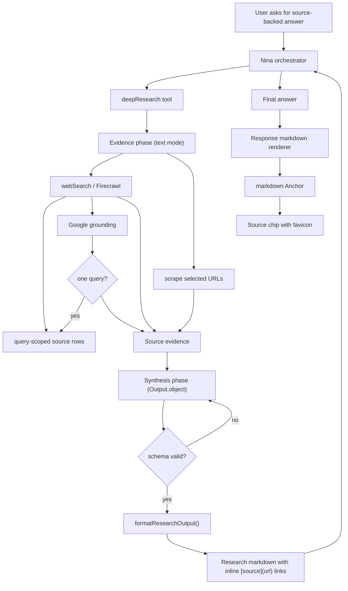
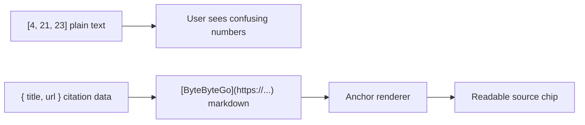

# Research Citation Flow

Research evidence has two separate surfaces:

- `data-web-search` renders the source tray.
- Firecrawl `data-web-search` parts are query-scoped, so each query renders
  beside its own returned sources.
- Google grounding runs after Firecrawl for corroboration. It writes a
  `data-web-search` part only when one provider query can be paired with the
  returned sources.
- Structured research output carries citation data.
- Structured synthesis retries inside the research agent. A schema-formatting
  miss must not rerun web search or duplicate source rows.
- Markdown links are rendered from citation data before Nina sees the research result.
- Nina's final answer contract keeps citations inline and rejects terminal
  source sections.

## Invariants

- Research synthesis uses AI SDK structured output, not free-form citation prose.
- Forced tool routing happens only during evidence collection, where provider
  response mode remains text.
- `Output.object()` happens only during synthesis, where tools are not active.
- Synthesis retries reuse the already-collected evidence instead of calling
  search again.
- Citation titles and URLs stay in structured fields until deterministic markdown
  rendering.
- The UI must not guess citations from arbitrary bracketed text. It renders real
  markdown links and structured `data-*` parts.
- `data-web-search` remains a source overview; inline citation links remain part
  of markdown text.

## Why

AI SDK source parts and custom `data-*` parts are separate from text parts.
Research therefore returns structured citation data first, then the AI package
renders inline markdown links deterministically.

## References

- AI SDK sources: https://ai-sdk.dev/docs/ai-sdk-ui/chatbot#sources
- AI SDK stream protocol: https://ai-sdk.dev/docs/ai-sdk-ui/stream-protocol
- AI Elements inline citation: https://elements.ai-sdk.dev/components/inline-citation
