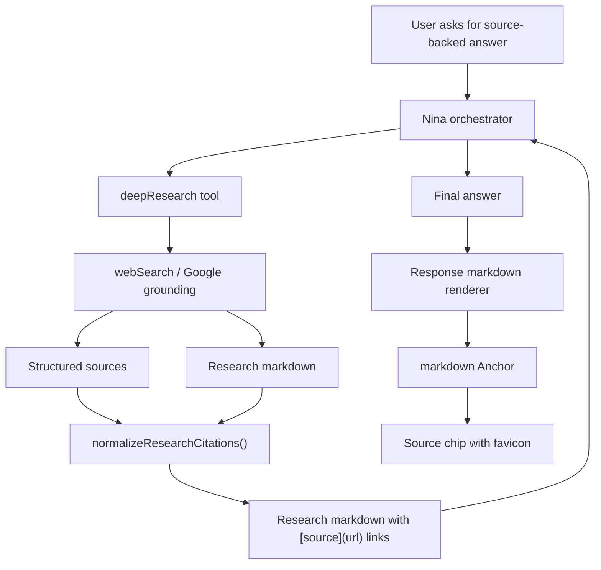
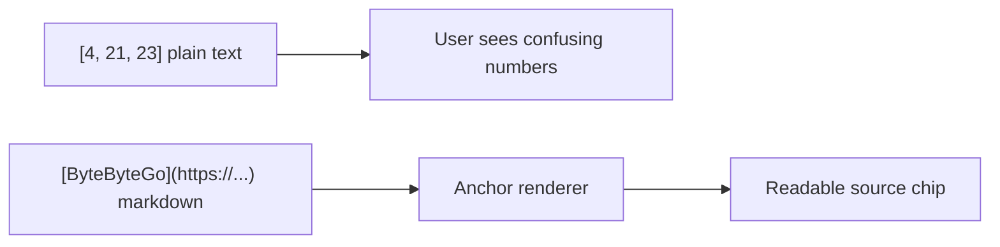

# Research Citation Flow

Research evidence has two separate surfaces:

- `data-web-search` renders the source tray.
- Markdown links render inline citations inside assistant text.

## Invariants

- Research output passed back to Nina must use markdown links, not numeric
  markers like `[4, 21, 23]`.
- The UI must not guess citations from arbitrary bracketed text. It renders real
  markdown links and structured `data-*` parts.
- Numeric citation indexes are normalized only when the same research artifact
  contains an indexed markdown source list.
- `data-web-search` remains a source overview; inline citation links remain part
  of markdown text.

## Why

AI SDK source parts and custom `data-*` parts are separate from text parts, so
inline citations need explicit markdown links before the response reaches the
markdown renderer.

## References

- AI SDK sources: https://ai-sdk.dev/docs/ai-sdk-ui/chatbot#sources
- AI SDK stream protocol: https://ai-sdk.dev/docs/ai-sdk-ui/stream-protocol
- AI Elements inline citation: https://elements.ai-sdk.dev/components/inline-citation
