# Bookmarks Module

User content bookmarks with playlist-style organization.

## Flows

### Quick Bookmark (No Collection)

```mermaid
sequenceDiagram
    participant U as User
    participant C as Client
    participant API as Convex

    U->>C: Click bookmark icon
    C->>API: getOrCreateDefaultCollection(userId)
    API->>API: Query userId_isDefault → unique()
    Note over API: Create if not exists

    C->>API: createBookmark({ slug, userId, collectionId, order })
    API->>API: Insert bookmarks
    API->>API: Increment bookmarkCollections.bookmarkCount
    API-->>C: Bookmarked
```

### Bookmark to Specific Collection

### Create Collection

### Move Bookmark Between Collections

### Delete Collection (Non-Default)

### Reorder Bookmarks

### Public Collection Sharing

## Edge Cases

| Case | Solution |
| ------ | ---------- |
| Duplicate bookmark | Check `userId_slug` index before insert |
| Delete default collection | Prevent via validation (use `userId_isDefault.unique()`) |
| Collection empty | `bookmarkCount = 0`, allow deletion |
| Public collection access | Filter by `userId_isPublic` index |
| Multiple default collections | `userId_isDefault` index with `.unique()` prevents this |

## Schema Notes

- `bookmarks`: User-saved content (slug, userId, collectionId, order, note, bookmarkedAt)
- `bookmarkCollections`: User playlists (name, userId, bookmarkCount, isDefault, isPublic, emoji, color, order)
