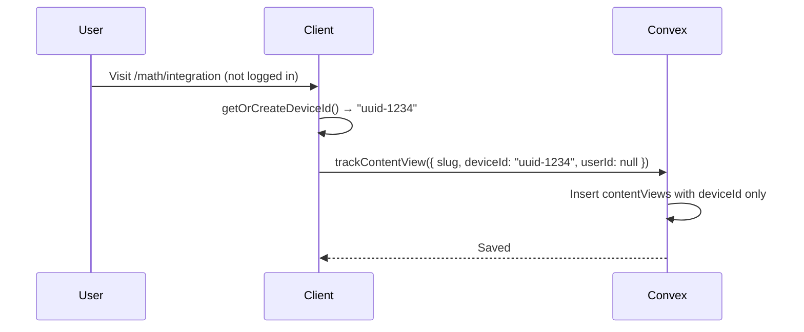
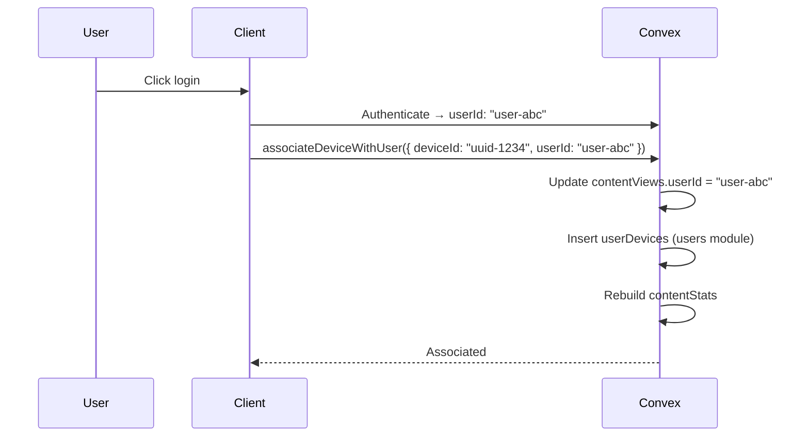
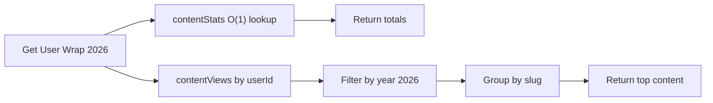
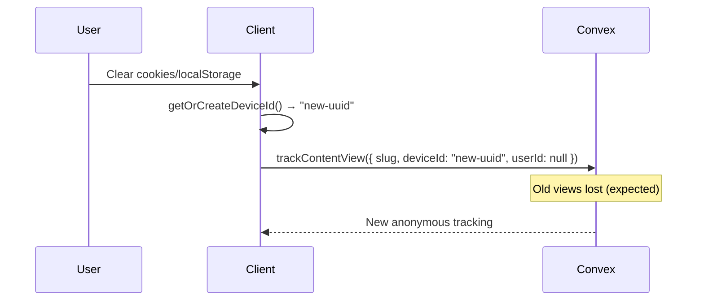

# Contents Module

Track user content views and analytics for year wrap feature.

## Flows

### Anonymous Tracking



### Login - Associate Device



### Multi-Device Tracking

```mermaid
graph LR
    A[Phone<br/>uuid-abc] --> B[contentViews]
    C[Laptop<br/>uuid-def] --> B
    D[Tablet<br/>uuid-ghi] --> B
    E[User Login] --> F[userDevices<br/>(users module)]
    B --> F
    F --> G[All devices → userId: user-123]
```

### Wrap Feature Query



### Device ID Cleared (New Anonymous)



## Edge Cases

| Case | Solution |
| ------ | ---------- |
| Anonymous on multiple devices → Login | Call `associateDeviceWithUser` for each device |
| Shared device (family) | `contentViews.userId` is per-view, not per-device |
| Incognito browsing | `isIncognito` flag marks these views |
| Account deletion (GDPR) | Clear `userId` from views or delete entirely |

## Schema Notes

- `contentViews`: Track every view per device/user
- `contentStats`: Denormalized per-user stats for O(1) wrap access
- `userDevices`: Moved to users module
