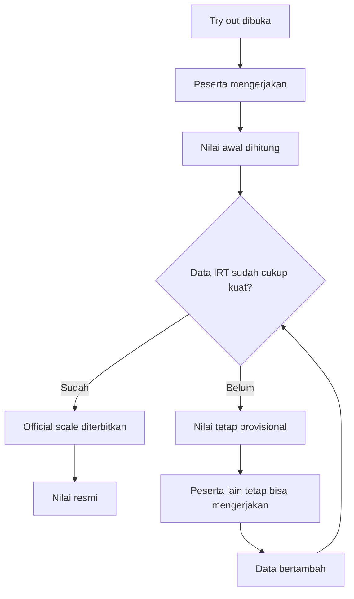
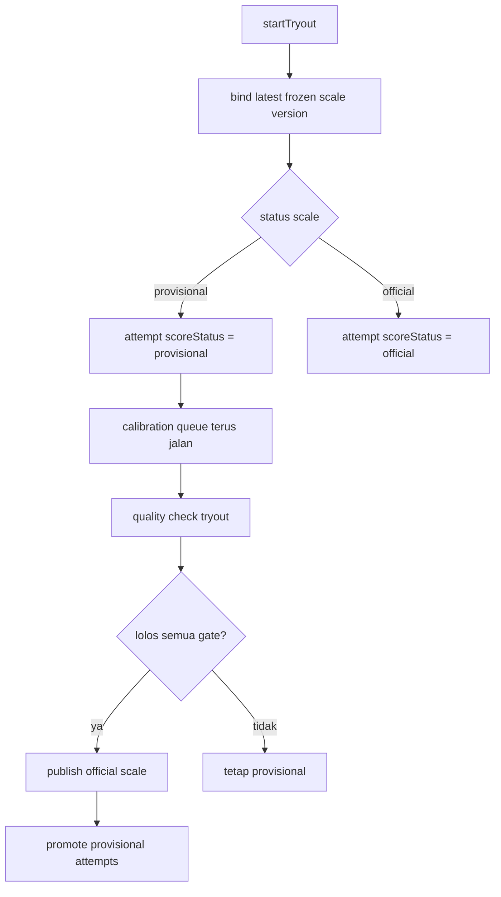
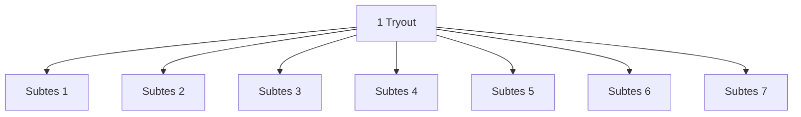

# Penjelasan IRT Nakafa

Dokumen ini ditulis untuk pembaca non-teknikal dan semi-teknikal yang perlu
memahami bagaimana nilai try out Nakafa menjadi **resmi**.

README utama tetap menjadi sumber teknikal utama:

- `packages/backend/convex/irt/README.md`

Policy produk yang direkomendasikan ada di:

- `packages/backend/convex/irt/PRODUCT_POLICY.id.md`

## Ringkasan Singkat

Nakafa memakai dua status nilai:

- `provisional`: nilai awal yang sudah bisa dipakai untuk menjalankan try out
  dan memberi estimasi kemampuan
- `official`: nilai yang sudah lolos pemeriksaan mutu IRT dan memakai frozen
  scale yang resmi

Artinya, peserta **tetap bisa mengerjakan try out** walaupun data belum cukup
untuk menyatakan nilainya resmi. Sistem tidak rusak ketika peserta masih sedikit.
Yang tertunda hanya status **resmi**-nya.

## Jawaban Singkat Untuk Pertanyaan Client

### 1. Kalau peserta masih sedikit, apakah sistem tetap bisa jalan?

Bisa.

Nakafa sengaja dirancang supaya:

- try out tetap bisa dibuka dengan scale `provisional`
- nilai awal tetap bisa dihitung
- sistem tidak memaksa nilai menjadi `official` terlalu cepat

Jadi concern utamanya bukan "sistem tidak bisa handle." Concern utamanya adalah
"apakah data yang terkumpul sudah cukup kuat untuk menyebut hasilnya resmi?"

### 2. Kapan nilai menjadi nilai resmi?

Nilai menjadi resmi ketika try out sudah punya **official frozen scale**.

Ada dua kemungkinan:

1. Jika official scale sudah ada saat peserta menyelesaikan try out, nilainya
   langsung resmi.
2. Jika peserta selesai saat scale masih `provisional`, nilainya disimpan dulu
   sebagai provisional, lalu akan dipromosikan otomatis setelah official scale
   terbit.

Jadi jawabannya bukan sekadar "setelah siswa mengerjakan try out". Lebih tepat:

> setelah siswa mengerjakan try out **dan** try out tersebut sudah lolos quality
> gate untuk official scale.

## Diagram Non-Teknikal

## Diagram Teknis Ringkas

## Visual Level Data

Supaya tidak ketukar, ini level datanya:

| Level | Contoh | Dipakai untuk apa? | Syarat utamanya |
|------|--------|--------------------|-----------------|
| `tryout` | TO SNBT 2026 Set 1 | menentukan apakah status tryout bisa `official` | semua gate harus lolos |
| `set` / `subtes` | penalaran umum, bahasa Inggris, dll | menghitung apakah tiap bagian punya cukup data hidup | minimal `200` live attempts **per set** |
| `question` / `soal` | soal nomor 12 di subtes bahasa Inggris | menentukan apakah parameter IRT soal sudah cukup dipercaya | harus `calibrated` |

## Visual Sederhana: 1 Tryout Punya 7 Subtes

Misalnya satu tryout punya 7 subtes.

Kalau aturan current policy meminta `200` live attempts, artinya:

- Subtes 1 harus punya minimal `200` attempt
- Subtes 2 harus punya minimal `200` attempt
- ...
- Subtes 7 juga harus punya minimal `200` attempt

Jadi ini **bukan** `200` untuk total tryout secara keseluruhan. Ini efektifnya
`200 per subtes / per set`.

## Apa Itu Live Attempt?

Bahasa gampangnya:

- `attempt biasa` = ada orang yang pernah mengerjakan
- `live attempt` = attempt yang masih dianggap relevan oleh sistem untuk kondisi
  sekarang

Di implementasi sekarang, `live attempt` berarti:

- attempt level **set / subtes**
- mode `simulation`
- status `completed`
- masih masuk jendela aktif `365` hari terakhir

Jadi kalau ada data lama di luar window itu, datanya tidak lagi dianggap cukup
fresh untuk membantu official gate.

## Apa Itu Calibrated?

Bahasa gampangnya:

> `calibrated` berarti sebuah soal sudah cukup "terbaca" oleh sistem, sehingga
> karakter IRT soal itu sudah cukup stabil untuk dipercaya.

Karakter yang dimaksud terutama:

- tingkat kesulitan soal (`difficulty`)
- daya beda soal (`discrimination`)

### Kapan sebuah soal dianggap calibrated?

Satu soal baru dianggap `calibrated` kalau **semua** ini terpenuhi:

1. jumlah responsnya cukup
   - minimal `200` respons pada soal itu
2. responsnya bervariasi
   - tidak semua orang benar
   - tidak semua orang salah
3. hasil fitting parameternya sudah stabil
   - perubahan parameter antar iterasi sudah kecil

Jadi `calibrated` bukan berarti:

- soal itu bagus secara pedagogis
- soal itu disukai siswa
- soal itu pasti final selamanya

Tetapi berarti:

- sistem sudah cukup yakin membaca parameter IRT soal itu

## Contoh Konkret

Misalnya ada 1 tryout dengan 7 subtes dan 150 peserta mengerjakan penuh.

Maka secara kasar:

- setiap subtes baru punya sekitar `150` set attempts
- itu berarti syarat `200 live attempts per set` belum lolos
- akibatnya tryout bisa tetap `provisional`

Kalau peserta naik jadi 250 dan datanya bagus:

- tiap subtes bisa lolos syarat `200 live attempts`
- tetapi official tetap belum otomatis lolos kalau masih ada soal yang belum
  `calibrated`

Jadi official butuh dua hal besar sekaligus:

- cukup data di level set
- cukup matang di level soal

## Quality Gate Saat Ini

Supaya sebuah try out bisa naik menjadi `official`, saat ini kode meminta semua
hal berikut benar:

- semua soal di try out sudah punya parameter item yang `calibrated`
- tidak ada item yang sudah basi di luar live calibration window
- setiap set soal dalam try out punya minimal `200` live calibration attempts

Kalau salah satu belum terpenuhi, hasilnya diblok sebagai official dan sistem
tetap memakai frozen scale terakhir yang aman.

## Apa Arti Ini Untuk Kolaborasi Client?

Secara sistem:

- Nakafa **bisa handle** walaupun peserta belum banyak
- try out tetap bisa berjalan
- nilai tetap bisa muncul

Secara kualitas IRT:

- semakin banyak respons yang relevan, semakin besar peluang scale naik menjadi
  `official`
- tambahan akses waktu bukan supaya sistem "tetap hidup"
- tambahan akses waktu berguna supaya kualitas data untuk official IRT makin kuat

Jadi kalau client bilang mereka ingin akses diperpanjang agar data IRT untuk set
berikutnya lebih maksimal, itu masuk akal secara teknis. Tetapi itu bukan karena
sistem Nakafa tidak bisa berjalan tanpa itu. Sistem tetap aman, hanya lebih
konservatif dalam memberi label `official`.

## Risiko Produk Yang Perlu Jujur Diakui

Secara teknis, sistem bisa tetap jalan walaupun data sedikit.

Tetapi secara pengalaman pengguna, ada risiko nyata:

- kalau data tidak pernah cukup, nilai bisa tetap `provisional` terlalu lama
- siswa bisa bingung karena merasa sudah selesai, tetapi statusnya tidak pernah
  menjadi resmi

Jadi ada dua hal yang harus dibedakan:

1. **concern sistem**
   - aman, bisa handle, tidak rusak
2. **concern produk / komunikasi**
   - siswa bisa bingung kalau label `official` tidak kunjung muncul

Itu artinya problem utamanya bukan hanya algoritme, tapi juga keputusan produk.

## Cara Menjelaskannya Ke Client

Kalimat yang paling aman biasanya begini:

> Sistem Nakafa tetap bisa menjalankan try out dan menghitung nilai awal meski
> partisipasi belum besar. Namun, label nilai resmi memang sengaja dibuat
> konservatif: hasil baru menjadi official setelah data IRT cukup kuat. Jadi,
> tambahan partisipasi bukan untuk mencegah sistem gagal, tetapi untuk
> mempercepat dan memperkuat peluang hasil naik menjadi official.

## Cara Menjelaskannya Ke Siswa

Kalau status `provisional` tetap ditampilkan ke siswa, sebaiknya bahasa
produknya sangat jelas, misalnya:

> Nilai ini adalah estimasi awal. Status resmi akan muncul setelah data try out
> terkumpul cukup untuk evaluasi IRT.

Kalau tidak ingin siswa bingung, secara produk biasanya ada tiga pilihan:

1. tampilkan nilai, tapi sembunyikan label `official/provisional`
2. tampilkan label, tapi beri penjelasan ETA / syarat kapan bisa resmi
3. tambahkan policy bisnis di luar IRT murni, misalnya cutoff event tertentu
   untuk menetapkan hasil akhir

Pilihan ketiga adalah keputusan produk/bisnis, bukan sesuatu yang otomatis sudah
dilakukan oleh kode sekarang.

## Referensi Ilmiah

Dokumen teknikal utama sudah mencatat basis publik yang dipakai pipeline ini.
Beberapa yang paling relevan untuk pembaca non-teknikal:

- Yen, W. M., & Fitzpatrick, A. R. (2006). *Item Response Theory*.
  ETS research chapter.
  https://www.ets.org/research/policy_research_reports/publications/chapter/2006/hsll.html
- Bock, R. D., & Mislevy, R. J. (1982). Adaptive EAP estimation of ability in a
  microcomputer environment.
  https://doi.org/10.1177/014662168200600405
- Chalmers, R. P. (2012). `mirt`: A Multidimensional Item Response Theory
  Package for the R Environment.
  https://doi.org/10.18637/jss.v048.i06
- Ulitzsch, E., von Davier, M., & Pohl, S. (2020). A review of modeling
  omitted and not-reached responses in IRT.
  https://pmc.ncbi.nlm.nih.gov/articles/PMC7221493/

## Kesimpulan Praktis

Kalau mau dijelaskan dengan satu kalimat ke client:

> Nakafa bisa tetap menjalankan try out dan menghitung nilai awal meskipun
> partisipasi belum besar, tetapi label nilai resmi baru diberikan ketika data
> IRT sudah cukup kuat menurut quality gate yang konservatif.
