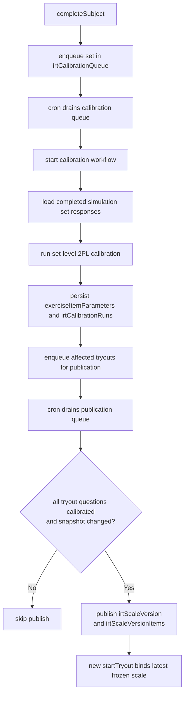
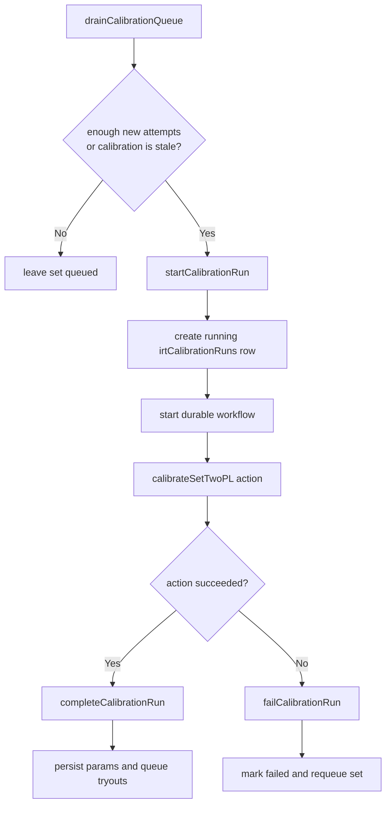

# IRT Calibration Pipeline

This module owns operational IRT scoring policy and durable item calibration for
 exercise sets.

## Current Operational Policy

- SNBT scoring uses `2PL`
- Ability estimation uses `EAP` over the operational 2PL item parameters
- New or weakly supported items remain `provisional` or `emerging`
- Official SNBT simulation attempts require a published tryout scale version
- Published scale versions freeze item parameters so official scores do not drift
  when future calibration runs update the live item bank
- Year-scoped global comparison is limited to the same locale and year, but does
  not currently perform additional cross-form linking beyond frozen calibrated
  scale versions

## Data Flow

## Modules

| File | Responsibility |
|------|----------------|
| `estimation.ts` | EAP theta estimation helpers |
| `scoring.ts` | Theta-to-score transforms |
| `policy.ts` | Centralized operational model and convergence policy |
| `calibration.ts` | Pure TypeScript 2PL calibration math |
| `internalQueries.ts` | Paginated response extraction for calibration |
| `internalActions.ts` | Set-level calibration job assembly and execution |
| `internalMutations.ts` | Run tracking and parameter persistence |
| `scaleVersions.ts` | Published tryout scale-version loading and snapshot helpers |
| `workflows.ts` | Durable orchestration for long-running calibration runs |

## Run Lifecycle

## Notes

- Calibration currently works at the `exerciseSet` level
- Calibration input is limited to `completed` `simulation` set attempts
- This pipeline improves item parameters and freezes official scales, but it does
  not attempt additional cross-form equating/linking for unique-item tryouts
