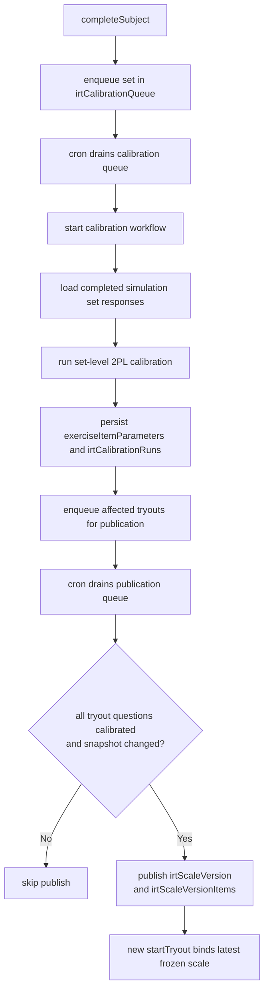
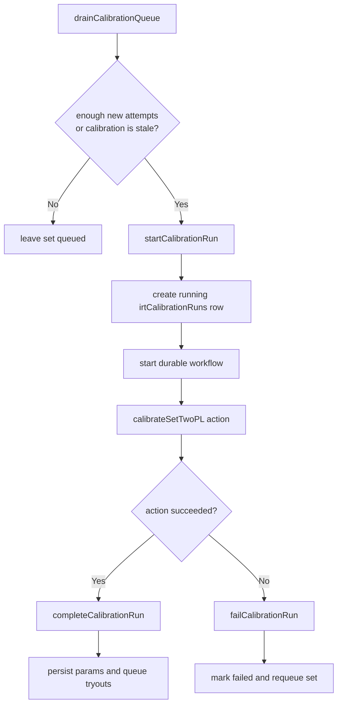

# IRT Calibration Pipeline

This module owns operational IRT scoring policy and durable item calibration for
 exercise sets.

## Documented Basis

Nakafa's current IRT pipeline is intentionally conservative and only claims the
parts we can support with public sources.

- `2PL` is a standard IRT model used in educational measurement references such
  as ETS's *Item Response Theory* chapter by Wendy M. Yen and Anne R.
  Fitzpatrick (2006):
  https://www.ets.org/research/policy_research_reports/publications/chapter/2006/hsll.html
- `EAP` ability estimation is a standard operational scoring method supported by
  expert psychometric software. The `TAM` documentation shows `2PL`
  calibration and returns `EAP` / `SD.EAP` person estimates:
  https://search.r-project.org/CRAN/refmans/TAM/html/tam.mml.html
- Missing-response handling in timed tests is not governed by one universal
  rule. ETS explicitly notes that the mechanism producing missingness must be
  considered for valid inference:
  https://www.ets.org/research/policy_research_reports/publications/report/1996/hxus.html
- Public psychometric literature shows heterogeneous operational practice for
  not-reached items in large-scale assessments. Ulitzsch, von Davier, and Pohl
  (2020) summarize that TIMSS and PIRLS ignore not-reached items for item
  parameter estimation and score them as incorrect for person parameter
  estimation:
  https://pmc.ncbi.nlm.nih.gov/articles/PMC7221493/
- The `TAM` documentation contains an explicit worked example of the same
  pattern: calibrate with omitted responses recoded to `NA`, then score persons
  with omitted responses recoded to `0`:
  https://search.r-project.org/CRAN/refmans/TAM/html/tam.mml.html

## Current Operational Policy

- SNBT scoring uses `2PL`
- Ability estimation uses `EAP` over the operational 2PL item parameters
- New or weakly supported items remain `provisional` or `emerging`
- Every active tryout has a published frozen scale version so it stays startable
- Scale versions are split into two product states:
  - `provisional`: bootstrap scoring only; enough to start and estimate a score
  - `official`: published from a fully calibrated tryout snapshot
- Completed attempts scored on a provisional scale remain provisional and are
  automatically re-scored once an official scale is published for that tryout
- Official attempts freeze item parameters so official scores do not drift when
  future calibration runs update the live item bank
- Year-scoped global comparison is limited to the same locale and year, but does
  not currently perform additional cross-form linking beyond frozen calibrated
  scale versions
- Operational tryout scoring treats unanswered timed items as incorrect when
  estimating student theta from a frozen tryout scale
- Calibration still uses only observed responses from `completed` simulation set
  attempts; unanswered items are not synthesized into the calibration dataset

## Missing-Response Policy

Nakafa currently uses this split policy:

- **Operational student scoring**: unanswered timed tryout items are treated as
  incorrect
- **Item calibration**: only observed responses are used
- **Cold start**: if a tryout already has a fully calibrated snapshot, Nakafa
  publishes an official scale immediately; otherwise it starts with a
  provisional bootstrap scale and auto-promotes completed attempts later

This is a documented operational choice, not a claim of universal psychometric
optimality. It matches a public pattern used in large-scale assessment and is
easier to reason about than silently ignoring blanks in student scoring.

What this policy does **not** claim:

- It does not claim that ignoring missingness is always valid
- It does not claim to model quitting, speed, or nonignorable missingness
- It does not claim cross-form equating beyond frozen published scale versions

## Data Flow

## Modules

| File | Responsibility |
|------|----------------|
| `estimation.ts` | EAP theta estimation helpers |
| `policy.ts` | Centralized operational model and convergence policy |
| `calibration.ts` | Pure TypeScript 2PL calibration math |
| `internalQueries.ts` | Paginated response extraction for calibration |
| `internalActions.ts` | Set-level calibration job assembly and execution |
| `internalMutations.ts` | Run tracking and parameter persistence |
| `helpers/cache.ts` | Calibration cache readiness and stats helpers |
| `helpers/queue.ts` | Queue and workflow orchestration helpers |
| `scales/read.ts` | Frozen scale lookups and coverage checks |
| `scales/snapshot.ts` | Publishable scale snapshot assembly and comparison |
| `scales/publish.ts` | Frozen scale publication and bootstrap helpers |
| `workflows.ts` | Durable orchestration for long-running calibration runs |

## Run Lifecycle

## Notes

- Calibration currently works at the `exerciseSet` level
- Calibration input is limited to `completed` `simulation` set attempts
- `irtCalibrationAttempts` is an operational cache, not the source of truth; the
  queue drainer trims each set back to a bounded working window before a new
  calibration run starts
- This pipeline improves item parameters and freezes official scales, but it does
  not attempt additional cross-form equating/linking for unique-item tryouts
- If Nakafa later wants a more advanced treatment of timed omissions, the next
  step is not more heuristics but an explicit missing-response model (for
  example, models that distinguish lack of speed from quitting as discussed by
  Ulitzsch, von Davier, and Pohl, 2020)
