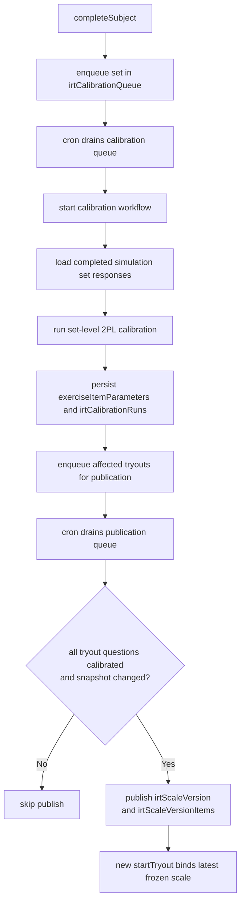
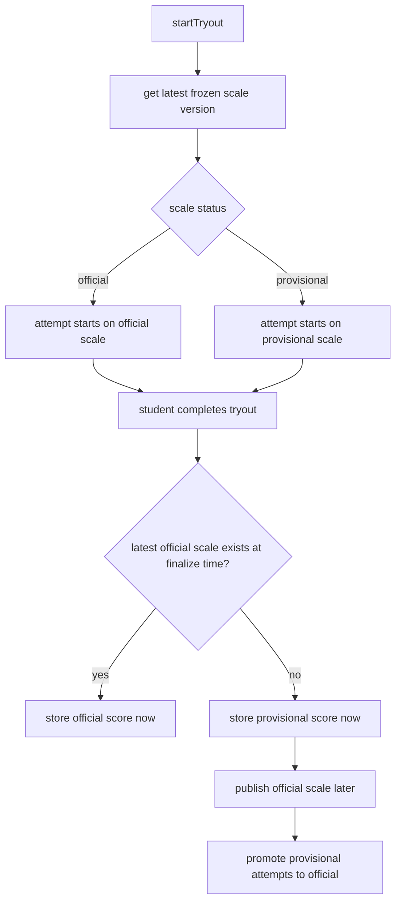
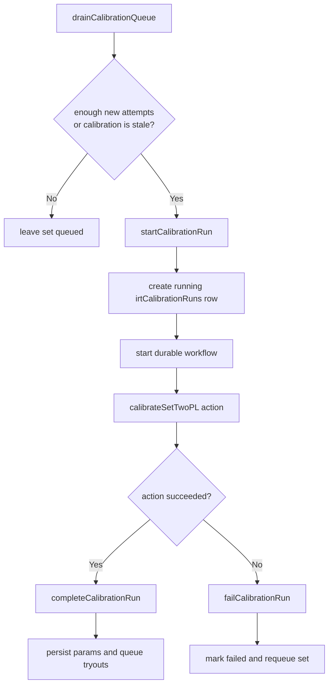

# IRT Calibration Pipeline

This module owns operational IRT scoring policy and durable item calibration for
exercise sets.

## Related Docs

- Explainer Bahasa Indonesia: `./docs/EXPLAINER.id.md`
- Product policy try out: `../tryouts/docs/PRODUCT_POLICY.id.md`

## Documented Basis

Nakafa's current IRT pipeline is intentionally conservative and only claims the
parts we can support with public sources.

- `2PL` is a standard IRT model used in educational measurement references such
  as ETS's *Item Response Theory* chapter by Wendy M. Yen and Anne R.
  Fitzpatrick (2006):
  https://www.ets.org/research/policy_research_reports/publications/chapter/2006/hsll.html
- `EAP` ability estimation is a standard operational scoring method supported by
  expert psychometric software. The `TAM` documentation shows `2PL`
  calibration and returns `EAP` / `SD.EAP` person estimates:
  https://search.r-project.org/CRAN/refmans/TAM/html/tam.mml.html
- Bock and Mislevy (1982) is the classic journal reference for `EAP` ability
  estimation in operational settings:
  https://doi.org/10.1177/014662168200600405
- Chalmers (2012) documents `mirt`, a widely used IRT package that also scores
  with bounded quadrature and exposes configurable `theta_lim` support for EAP:
  https://doi.org/10.18637/jss.v048.i06
- Missing-response handling in timed tests is not governed by one universal
  rule. ETS explicitly notes that the mechanism producing missingness must be
  considered for valid inference:
  https://www.ets.org/research/policy_research_reports/publications/report/1996/hxus.html
- Public psychometric literature shows heterogeneous operational practice for
  not-reached items in large-scale assessments. Ulitzsch, von Davier, and Pohl
  (2020) summarize that TIMSS and PIRLS ignore not-reached items for item
  parameter estimation and score them as incorrect for person parameter
  estimation:
  https://pmc.ncbi.nlm.nih.gov/articles/PMC7221493/
- The `TAM` documentation contains an explicit worked example of the same
  pattern: calibrate with omitted responses recoded to `NA`, then score persons
  with omitted responses recoded to `0`:
  https://search.r-project.org/CRAN/refmans/TAM/html/tam.mml.html

## Current Operational Policy

- SNBT scoring uses `2PL`
- Ability estimation uses `EAP` over the operational 2PL item parameters
- New or weakly supported items remain `provisional` or `emerging`
- Every active tryout has a published frozen scale version so it stays startable
- Scale versions are split into two product states:
  - `provisional`: bootstrap scoring only; enough to start and estimate a score
  - `official`: published from a fully calibrated tryout snapshot
- Official publication now checks a rolling live calibration window and stores a
  persisted quality summary before promoting a new frozen scale version
- Completed attempts scored on a provisional scale remain provisional and are
  automatically re-scored once an official scale is published for that tryout
- Official attempts freeze item parameters so official scores do not drift when
  future calibration runs update the live item bank
- The live calibration bank uses a rolling trailing window and must pass an
  explicit quality check before a new official scale is published
- Year-scoped global comparison is limited to the same locale and year, but does
  not currently perform additional cross-form linking beyond frozen calibrated
  scale versions
- Operational tryout scoring treats unanswered timed items as incorrect when
  estimating student theta from a frozen tryout scale
- Calibration still uses only observed responses from `completed` simulation set
  attempts; unanswered items are not synthesized into the calibration dataset
- Operational EAP now integrates over `[-6, 6]` with `61` equally spaced nodes,
  while the public SNBT report score remains a separate `0-1000` transform
  anchored to `[-4, 4]`

## Practical Answers

### Can Nakafa handle a tryout with limited participation?

Yes, but the system deliberately separates **startability** from **official IRT
readiness**.

- A tryout can stay startable with a frozen `provisional` scale version.
- A tryout only upgrades to `official` when its current live calibration state
  passes every quality gate.
- If participation is still low, the pipeline does **not** force an official
  result early. It keeps the latest frozen scale, usually `provisional`, until
  the evidence is strong enough.

In other words, low participation does not break the product. It only delays the
moment when Nakafa is willing to call the score **official**.

Operational integrity checks should treat that state as healthy as long as the
tryout still has a published frozen scale version. A `blocked` quality summary
means "not ready for official publication yet", not "tryout cannot run".

### When does a score become official?

There are two cases:

1. If the latest frozen scale is already `official` when the student finishes,
   the attempt is finalized as `official` immediately.
2. If the student finishes while the tryout still uses a `provisional` scale,
   the attempt is stored as `provisional` first and later auto-promoted when an
   `official` scale is published for that tryout.

That promotion is automatic. Nakafa re-scores completed provisional attempts
against the newly published official frozen scale version.

### What must be true before a tryout can publish an official scale?

The current code requires all of the following:

- every tryout question has a `calibrated` item parameter
- no calibrated question is outside the live calibration window
- every set in the tryout has at least `200` live calibration attempts

Those checks are enforced in `scales/quality.ts` and used by
`scales/publish.ts` before any new official scale version is published.

## Missing-Response Policy

Nakafa currently uses this split policy:

- **Operational student scoring**: unanswered timed tryout items are treated as
  incorrect
- **Item calibration**: only observed responses are used
- **Cold start**: if a tryout already has a fully calibrated snapshot, Nakafa
  publishes an official scale immediately; otherwise it starts with a
  provisional bootstrap scale and auto-promotes completed attempts later

This is a documented operational choice, not a claim of universal psychometric
optimality. It matches a public pattern used in large-scale assessment and is
easier to reason about than silently ignoring blanks in student scoring.

## Theta Bounds And Reporting

- **Estimation support**: Nakafa integrates EAP over `[-6, 6]` with `61` nodes.
  This follows the general operational practice of bounded quadrature while
  giving the posterior more tail room than the previous `[-4, 4]` support.
- **Public report scale**: Nakafa separately maps theta to the user-facing
  `0-1000` SNBT score using `[-4, 4]` as the reporting anchors.

This separation is intentional:

- the wider estimation support is a psychometric/numerical choice
- the public `0-1000` score is a product reporting choice

Separating them does not change the underlying IRT model. It only avoids tying
the public score anchors to the exact quadrature support chosen for EAP.

What this policy does **not** claim:

- It does not claim that ignoring missingness is always valid
- It does not claim to model quitting, speed, or nonignorable missingness
- It does not claim cross-form equating beyond frozen published scale versions

## Data Flow

## Result Status Lifecycle

## Why More Responses Still Matter

More participation does not just increase volume. It increases the chance that a
tryout can pass the official publication gates **without** lowering quality.

- More completed simulation attempts improve the live calibration cache.
- More supported items can move from `emerging` / `provisional` to
  `calibrated`.
- More recent attempts make it easier to satisfy the live-window freshness gate.

So if a partner asks for more access time, the strongest technical argument is
not "otherwise Nakafa breaks." The stronger statement is:

> the system can still operate safely with lower participation, but additional
> high-quality responses improve the chance that the tryout can graduate from a
> provisional score state to an official IRT-backed score state sooner.

## Modules

| File | Responsibility |
|------|----------------|
| `estimation.ts` | EAP theta estimation helpers |
| `policy.ts` | Centralized operational model and convergence policy |
| `calibration.ts` | Pure TypeScript 2PL calibration math |
| `queries/internal/calibration.ts` | Paginated response extraction for calibration |
| `queries/internal/maintenance.ts` | Operational cache integrity checks |
| `actions/internal/calibration.ts` | Set-level calibration job assembly and execution |
| `mutations/internal/responses.ts` | Calibration response cache sync entrypoints |
| `mutations/internal/cache.ts` | Cache stats rebuild and trim entrypoints |
| `mutations/internal/queue.ts` | Queue draining and queue cleanup entrypoints |
| `mutations/internal/runs.ts` | Run completion and failure entrypoints |
| `mutations/internal/scales.ts` | Scale quality refresh and publication queue entrypoints |
| `helpers/attempts.ts` | Calibration attempt normalization helpers |
| `helpers/cache.ts` | Calibration cache readiness and stats helpers |
| `helpers/queue.ts` | Queue and workflow orchestration helpers |
| `scales/loaders.ts` | Shared invariant-enforcing loaders for scale publication |
| `scales/bootstrap.ts` | Provisional scale bootstrap helpers |
| `scales/quality.ts` | Official-scale quality gates and persisted summaries |
| `scales/read.ts` | Frozen scale lookups and coverage checks |
| `scales/snapshot.ts` | Publishable scale snapshot assembly and comparison |
| `scales/publish.ts` | Frozen scale publication and bootstrap helpers |
| `workflows.ts` | Durable orchestration for long-running calibration runs |

## Run Lifecycle

## Notes

- Calibration currently works at the `exerciseSet` level
- Calibration input is limited to `completed` `simulation` set attempts
- `irtCalibrationAttempts` is an operational cache, not the source of truth; the
  queue drainer trims each set back to a bounded working window before a new
  calibration run starts
- This pipeline improves item parameters and freezes official scales, but it does
  not attempt additional cross-form equating/linking for unique-item tryouts
- If Nakafa later wants a more advanced treatment of timed omissions, the next
  step is not more heuristics but an explicit missing-response model (for
  example, models that distinguish lack of speed from quitting as discussed by
  Ulitzsch, von Davier, and Pohl, 2020)
