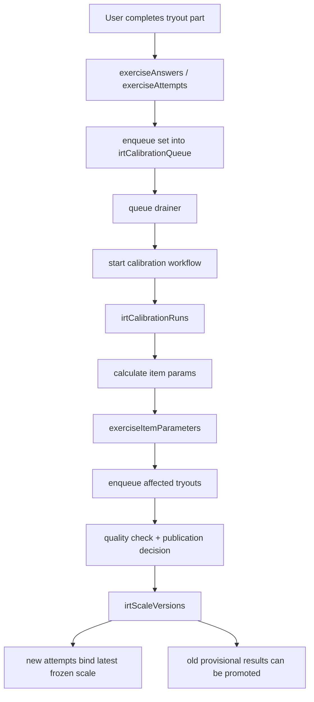

# Arsitektur Pipeline IRT Nakafa

Dokumen ini menjelaskan arsitektur pipeline IRT Nakafa dengan fokus pada dua
hal:

- mudah dipahami oleh product, ops, dan support
- tetap cukup teknikal untuk engineering yang perlu menelusuri flow backend

Dokumen terkait:

- `../README.md`
- `./EXPLAINER.id.md`
- `../../tryouts/README.md`
- `../../tryouts/docs/ARCHITECTURE.id.md`
- `../../tryouts/docs/PRODUCT_POLICY.id.md`

## Ringkasan Singkat

IRT di Nakafa bekerja sebagai lapisan kualitas score.

Ia tidak bertugas mengatur siapa boleh masuk atau bagaimana event ditutup.
Tugas utamanya adalah:

- menjaga setiap try out aktif tetap punya frozen scale yang aman dipakai
- meningkatkan kualitas item parameter seiring respons bertambah
- menerbitkan `official` frozen scale saat quality gate sudah lolos
- mempromosikan hasil lama dari `provisional` ke `official` bila perlu

Bahasa sederhananya:

- try out harus tetap bisa jalan lebih dulu
- kualitas psychometric boleh membaik kemudian
- produk event boleh final tanpa menunggu official IRT

## Peran Modul

### `tryouts/`

Modul ini membuat attempt dan membaca hasil user.
Saat attempt dimulai, modul ini mengambil frozen scale terbaru yang aman dipakai.

### `irt/`

Modul ini menjaga kualitas frozen scale tersebut.

Ia membaca respons nyata, menghitung parameter item, menjalankan quality gate,
dan menerbitkan scale baru bila sudah layak.

### `contentSync/`

Modul ini menyinkronkan definisi try out dan set yang dipakai oleh pipeline IRT.
Kalau definisi try out berubah, pipeline IRT juga membaca perubahan itu melalui
`tryouts` dan `tryoutPartSets`.

## Prinsip Desain

1. startability lebih penting daripada menunggu official
2. frozen scale adalah source of truth saat attempt berjalan
3. item calibration dan public event finality adalah dua hal berbeda
4. respons live dipakai untuk meningkatkan kualitas, bukan untuk mengubah hasil
   lama secara liar tanpa frozen version
5. perubahan kualitas harus lewat publication flow yang eksplisit

## Tabel Penting

### Kalibrasi dan Queue

- `irtCalibrationQueue`
  - antrian set yang perlu diproses ulang
- `irtCalibrationAttempts`
  - cache respons untuk kebutuhan kalibrasi
- `irtCalibrationCacheStats`
  - statistik cache per set
- `irtCalibrationRuns`
  - jejak satu run kalibrasi

### Kualitas dan Publikasi

- `irtScaleQualityChecks`
  - ringkasan apakah sebuah try out sudah layak naik ke `official`
- `irtScaleQualityRefreshQueue`
  - antrian refresh quality summary
- `irtScalePublicationQueue`
  - antrian try out yang perlu dicek untuk publication

### Frozen Scale

- `irtScaleVersions`
  - versi frozen scale per try out
- `irtScaleVersionItems`
  - snapshot parameter item untuk frozen scale tertentu

### Data Pendukung

- `exerciseItemParameters`
  - parameter item live terbaru
- `tryouts`
  - definisi try out aktif
- `tryoutPartSets`
  - mapping try out ke set/subtes

## Journey Data Dari Respons Sampai Hasil Official

### 1. User mengerjakan try out

- `tryouts/` menyimpan attempt dan jawaban per part
- saat selesai, attempt bisa berstatus internal:
  - `provisional`
  - `official`

### 2. Respons masuk ke jalur kalibrasi

- respons set yang relevan masuk ke `irtCalibrationQueue`
- queue drainer memilih set yang perlu diproses

### 3. Workflow kalibrasi berjalan

- sistem membuat `irtCalibrationRuns`
- action kalibrasi membaca cache respons dan menghitung parameter item
- hasilnya disimpan ke `exerciseItemParameters`

### 4. Try out yang terdampak diantrekan untuk publication

- perubahan item parameter memicu refresh quality dan publication queue
- sistem mengecek apakah seluruh syarat official terpenuhi

### 5. Frozen scale baru diterbitkan

- jika belum layak official, try out tetap memakai frozen scale lama yang aman
- jika layak, sistem membuat `irtScaleVersions` baru dan item snapshot-nya

### 6. Hasil lama bisa dipromosikan

- attempt lama yang selesai saat scale masih provisional bisa dinaikkan menjadi
  official setelah frozen scale official tersedia

## Diagram Arsitektur

## Apa Yang Dilihat User vs Apa Yang Terjadi Di Belakang Layar

### Yang dilihat user

- bisa mulai try out selama ada frozen scale yang aman
- bisa melihat score publik
- bisa melihat label publik seperti `Estimasi Awal`, `Terverifikasi IRT`, atau
  `Final Event`

### Yang terjadi di belakang layar

- sistem terus mengkalibrasi item dari respons baru
- quality summary bisa berubah
- frozen scale official bisa terbit belakangan
- hasil lama tertentu bisa dipromosikan tanpa mengubah finalitas event

## Kenapa Kita Memisahkan `provisional` dan `official`

Karena dua pertanyaan ini berbeda:

- apakah try out bisa dijalankan sekarang?
- apakah kualitas psychometric sudah cukup untuk menyebut hasilnya official?

Kalau dua hal ini dicampur, produk akan terlalu rapuh.
Dengan pemisahan sekarang:

- user tetap bisa mengerjakan try out
- engineering tidak perlu memaksa publication dini
- ops bisa menjelaskan kenapa hasil masih estimasi awal tanpa bilang sistem rusak

## Hubungan Dengan Event Dan Competition

IRT tidak menentukan apakah event sudah final.

Event finality ada di policy try out:

- `competition` bisa berakhir dengan `Final Event`
- internal IRT tetap boleh `provisional` atau `official`

Jadi:

- `official` = resmi secara psychometric
- `Final Event` = final secara produk event

## Checklist Operasional

Saat ada perubahan besar di try out atau IRT:

1. deploy backend Convex
2. sync content agar definisi try out dan katalog tetap segar
3. verifikasi cache integrity
4. verifikasi scale integrity
5. pastikan semua active tryout tetap punya frozen scale

Perintah penting:

- `pnpm --filter @repo/backend sync`
- `pnpm --filter @repo/backend sync:prod`
- `pnpm --filter @repo/backend irt:verify:cache`
- `pnpm --filter @repo/backend irt:verify:scale`
- `pnpm --filter @repo/backend irt:prod:verify:cache`
- `pnpm --filter @repo/backend irt:prod:verify:scale`

## Pertanyaan Yang Sering Muncul

### Kalau partisipasi rendah, apakah try out berhenti bekerja?

Tidak. Yang tertunda adalah official publication, bukan startability.

### Apakah setiap update item parameter langsung mengubah hasil user?

Tidak. Attempt berjalan di atas frozen scale, bukan item parameter live yang bisa
terus berubah.

### Apakah semua hasil provisional pasti nanti jadi official?

Tidak otomatis. Try out tetap harus lolos quality gate official.

### Kenapa kita masih butuh queue dan workflow?

Karena kalibrasi dan publication adalah pekerjaan background yang harus tahan
gagal, bounded, dan bisa diulang tanpa merusak state utama.
