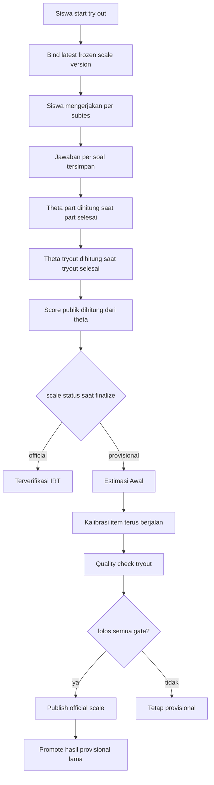

# Penjelasan IRT Nakafa

Dokumen ini menjelaskan alur IRT Nakafa dengan bahasa yang lebih mudah dipahami.

Source of truth teknikal tetap ada di:

- `../README.md`

Policy produk try out ada di:

- `../../tryouts/docs/PRODUCT_POLICY.id.md`

## Ringkasan

Nakafa memakai dua lapisan hasil:

- hasil internal psychometric: `provisional` atau `official`
- skor publik: skor `0-1000` yang diturunkan dari `theta`

Artinya:

- siswa tetap bisa mengerjakan try out walaupun data belum cukup untuk official
- sistem tetap aman saat partisipasi masih rendah
- yang bisa tertunda adalah label `official`, bukan jalannya try out

Kalau try out berakhir saat siswa belum menyentuh semua subtes:

- subtes yang tidak pernah dimulai tetap dihitung sebagai salah semua untuk skor
  try out final
- ringkasan per subtes tetap muncul, meskipun subtes itu tidak pernah dibuka

## Diagram Final

## Apa Itu Theta?

Bahasa gampangnya:

> `theta` adalah estimasi kemampuan siswa menurut model IRT.

Yang dihitung sistem IRT pertama kali adalah `theta`, bukan angka `0-1000`
langsung.

Urutannya:

- raw score = berapa soal benar
- `theta` = estimasi kemampuan menurut IRT
- skor publik `0-1000` = transformasi laporan dari `theta`

### Apakah theta benar-benar ada di sistem?

Iya. `theta` disimpan di backend, misalnya pada:

- `tryoutAttempts.theta`
- `tryoutPartAttempts.theta`
- `tryoutLeaderboardEntries.theta`

Artinya, source of truth score sekarang memang `theta`.

## Bedanya `[-6, 6]` dan `[-4, 4]`

Ini dua range yang berbeda fungsi.

### `[-6, 6]`

Ini dipakai untuk **ruang hitung estimasi**.

- dipakai saat EAP integration
- ini adalah estimation support / quadrature grid
- dibuat lebih lebar supaya pola jawaban ekstrem tidak terlalu cepat mentok di
  batas hitung

### `[-4, 4]`

Ini dipakai untuk **skala laporan ke user**.

- dipakai saat `theta` diubah menjadi skor publik `0-1000`
- ini adalah reporting anchors

Mapping publik sekarang:

- `theta = -4` -> `0`
- `theta = 0` -> `500`
- `theta = 4` -> `1000`

Kalau `theta` hasil estimasi lebih kecil dari `-4` atau lebih besar dari `4`,
nilainya tetap di-clamp saat dibentuk menjadi skor publik.

### Kenapa dua range ini dipisah?

Karena fungsinya memang beda:

- `[-6, 6]` = untuk mesin hitung IRT
- `[-4, 4]` = untuk angka yang dibaca user

Ini tetap `theta` yang sama. Yang beda hanya konteks pemakaiannya.

## Kapan Hasil Menjadi Official?

Hasil menjadi official ketika try out sudah punya **official frozen scale**.

Ada dua kemungkinan:

1. Kalau official scale sudah ada saat siswa selesai, hasilnya langsung official.
2. Kalau siswa selesai saat scale masih provisional, hasilnya disimpan dulu
   sebagai provisional, lalu dipromosikan otomatis setelah official scale
   diterbitkan.

Kalau try out berakhir karena waktu habis, sistem tetap menutup hasil pada level
try out penuh. Jadi bagian yang tidak sempat dimulai tidak dihilangkan dari hasil
akhir; bagian itu tetap dihitung sebagai jawaban salah semua.

## Level Data Yang Perlu Dibedakan

| Level | Contoh | Dipakai untuk apa? | Syarat utamanya |
|------|--------|--------------------|-----------------|
| `tryout` | TO SNBT 2026 Set 1 | menentukan apakah hasil try out bisa `official` | semua gate harus lolos |
| `set` / `subtes` | penalaran umum, bahasa Inggris, dll | mengecek apakah tiap bagian punya cukup data hidup | minimal `200` live attempts per set |
| `question` / `soal` | satu soal di satu subtes | mengecek apakah parameter IRT soal sudah cukup dipercaya | harus `calibrated` |

## Apa Itu Live Attempt?

Bahasa gampangnya:

- `attempt biasa` = ada orang yang pernah mengerjakan
- `live attempt` = attempt yang masih dianggap relevan oleh sistem untuk kondisi
  sekarang

Di implementasi sekarang, `live attempt` berarti:

- attempt level set / subtes
- mode `simulation`
- status `completed`
- masih masuk jendela aktif `365` hari terakhir

Jadi syarat `200 live attempts` itu efektifnya berarti:

- setiap set / subtes di dalam try out harus punya minimal `200` attempt hidup

Itu bukan `200` total untuk seluruh try out.

## Apa Itu Calibrated?

Bahasa gampangnya:

> `calibrated` berarti sebuah soal sudah cukup terbaca oleh sistem, sehingga
> parameter IRT-nya sudah cukup stabil untuk dipercaya.

Yang dimaksud terutama:

- tingkat kesulitan (`difficulty`)
- daya beda (`discrimination`)

Satu soal dianggap `calibrated` kalau semua ini terpenuhi:

1. responsnya cukup banyak
   - minimal `200` respons
2. responsnya bervariasi
   - tidak semua benar dan tidak semua salah
3. fitting parameternya sudah stabil
   - perubahan parameter antar iterasi sudah kecil

Jadi `calibrated` bukan berarti soal itu otomatis bagus secara pedagogis.
Artinya adalah: sistem sudah cukup yakin membaca karakter IRT soal tersebut.

## Quality Gate Official Saat Ini

Supaya try out bisa naik menjadi `official`, saat ini semua hal ini harus lolos
bersamaan:

- semua soal dalam try out sudah `calibrated`
- tidak ada item yang `stale` di luar live calibration window
- setiap set dalam try out punya minimal `200` live calibration attempts

Kalau satu saja gagal, hasil official ditahan dan sistem tetap memakai frozen
scale terakhir yang aman.

## Dampak Praktis Untuk Client

Secara sistem:

- Nakafa bisa handle walaupun peserta belum banyak
- try out tetap bisa berjalan
- nilai tetap bisa muncul

Secara kualitas IRT:

- makin banyak respons yang relevan, makin besar peluang scale naik menjadi
  `official`
- tambahan akses waktu membantu kualitas data, bukan mencegah sistem gagal

## Referensi Ilmiah

- Yen, W. M., & Fitzpatrick, A. R. (2006). *Item Response Theory*.
  https://www.ets.org/research/policy_research_reports/publications/chapter/2006/hsll.html
- Bock, R. D., & Mislevy, R. J. (1982). Adaptive EAP estimation of ability in a
  microcomputer environment.
  https://doi.org/10.1177/014662168200600405
- Chalmers, R. P. (2012). `mirt`: A Multidimensional Item Response Theory
  Package for the R Environment.
  https://doi.org/10.18637/jss.v048.i06
- Ulitzsch, E., von Davier, M., & Pohl, S. (2020). A review of modeling
  omitted and not-reached responses in IRT.
  https://pmc.ncbi.nlm.nih.gov/articles/PMC7221493/
