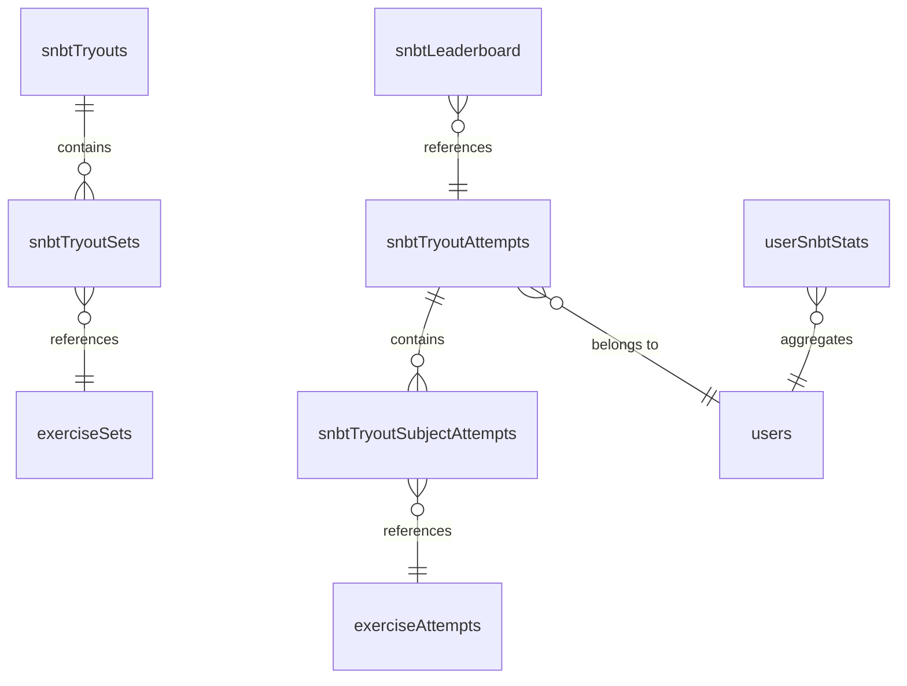
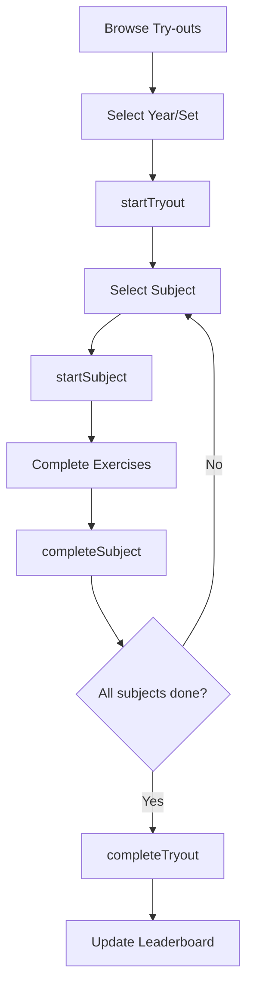

# SNBT Try-Out System

SNBT try-out with IRT scoring. Users complete 7 subjects, system calculates θ (theta) for ranking.

## Data Model

## Tables

| Table | Fields |
|-------|--------|
| `snbtTryouts` | `year`, `slug` (`{year}-{setName}`), `setName`, `locale`, `subjectCount`, `isActive` |
| `snbtTryoutSets` | `tryoutId`, `setId`, `subjectIndex` |
| `snbtTryoutAttempts` | `userId`, `tryoutId`, `mode`, `status`, `completedSubjectIndices`, `theta`, `irtScore` |
| `snbtTryoutSubjectAttempts` | `tryoutAttemptId`, `subjectIndex`, `setAttemptId`, `theta` |
| `userSnbtStats` | `userId`, `locale`, `averageTheta`, `totalTryoutsCompleted` |
| `snbtLeaderboard` | `tryoutId`, `userId`, `theta`, `irtScore`, `rawScore` (Aggregate handles ranking) |

## User Flow

## Queries

| Query | Purpose |
|-------|---------|
| `getActiveTryouts` | List active try-outs (grouped by year in UI) |
| `getTryoutDetails` | Get try-out + subjects by slug |
| `getUserTryoutAttempt` | Current user progress |
| `getTryoutContextForAttempt` | Detect try-out context from exercise |
| `getTryoutLeaderboard` | Per-tryout rankings (O(log n) via Aggregate) |
| `getGlobalLeaderboard` | Overall rankings (O(log n) via Aggregate) |

## Mutations

| Mutation | Purpose |
|----------|---------|
| `startTryout` | Create try-out attempt |
| `startSubject` | Create subject attempt |
| `completeSubject` | Calculate subject θ, mark complete |
| `completeTryout` | Final θ, update stats/leaderboard |

## IRT Scoring

- EAP (Expected A Posteriori) estimation
- Scale: 200-1000 (θ=0 → 600)
- See `convex/irt/` forimplementation