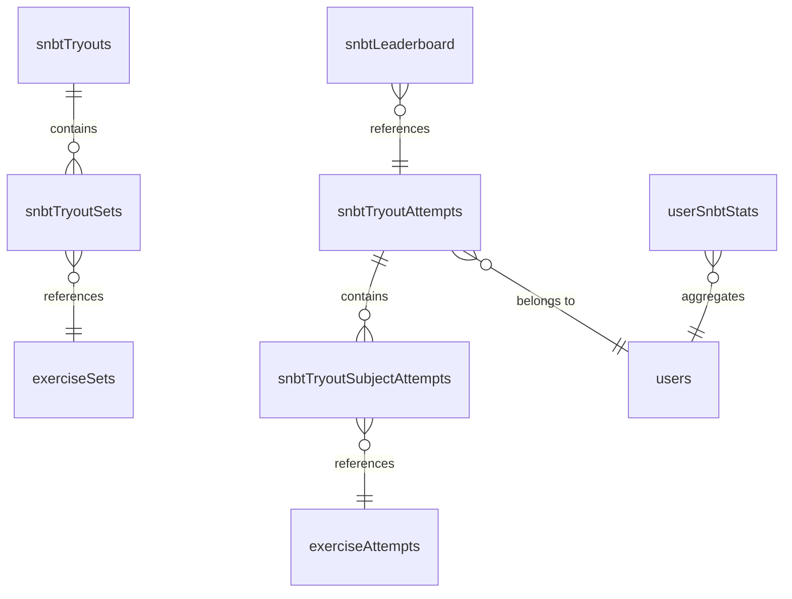
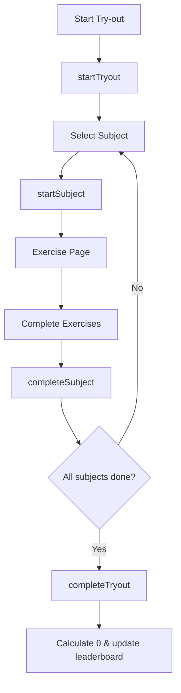

# SNBT Try-Out System

SNBT try-out with IRT scoring. Users complete 7 subjects, system calculates θ (theta) for ranking.

## Data Model

## Tables

| Table | Purpose |
|-------|---------|
| `snbtTryouts` | Try-out metadata (synced from content) |
| `snbtTryoutSets` | Links try-out to exercise sets |
| `snbtTryoutAttempts` | User's try-out progress |
| `snbtTryoutSubjectAttempts` | Per-subject attempt tracking |
| `userSnbtStats` | Aggregated user performance |
| `snbtLeaderboard` | Per-tryout rankings |

## User Flow

## Functions

**Queries:**
- `getActiveTryouts` - List active try-outs
- `getTryoutDetails` - Get try-out + subjects
- `getUserTryoutAttempt` - Current progress
- `getTryoutContextForAttempt` - Detect try-out context
- `getTryoutLeaderboard` - Per-tryout rankings (O(log n) via Aggregate)
- `getGlobalLeaderboard` - Overall rankings (O(log n) via Aggregate)
- `getUserTryoutRank` - User's rank (O(log n) via Aggregate)

**Mutations:**
- `startTryout` - Create attempt
- `startSubject` - Create subject attempt
- `completeSubject` - Calculate subject θ
- `completeTryout` - Final θ + leaderboard

## IRT Scoring

EAP (Expected A Posteriori) estimation:
- θ = ability score
- Scale: 200-1000 (θ=0→600)

See `convex/irt/` for estimation algorithm.