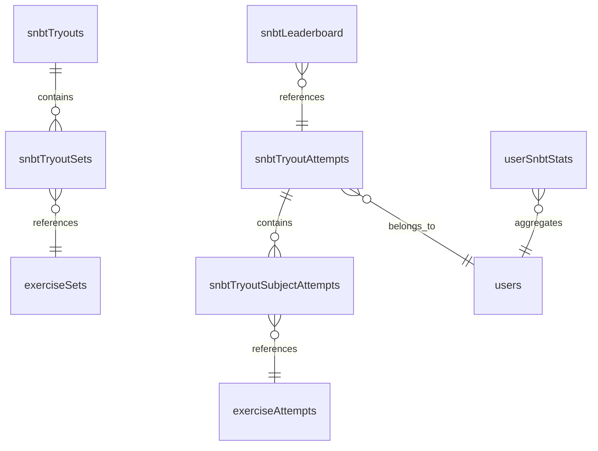
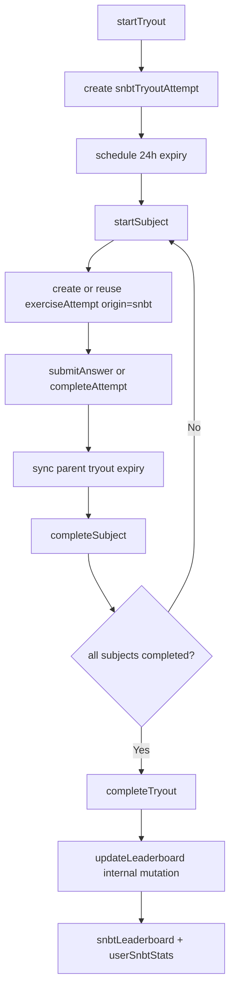

# SNBT Try-Out System

SNBT try-out backend built on top of the shared `exerciseAttempts` engine.
Each subject uses the normal exercise timer and answer flow, while the SNBT
tables own try-out lifecycle, IRT scoring, and official leaderboard rules.

## Core Rules

- A try-out attempt stays open for at most 24 hours from `startedAt`
- Subject attempts are stored in `exerciseAttempts` with `origin: "snbt"`
- Simulation subjects use a fixed time limit of `90` seconds per question
- Practice subjects may choose a custom time limit
- Only the first completed simulation attempt per user per try-out is official
- Practice attempts and later retries never update the official leaderboard

## Data Model

## Tables

| Table | Purpose |
|-------|---------|
| `exerciseAttempts` | Shared exercise engine. SNBT subjects use `origin: "snbt"`; standalone exercise pages use `origin: "standalone"`. |
| `snbtTryouts` | Auto-detected SNBT try-out definitions keyed by locale/year/slug. |
| `snbtTryoutSets` | Maps a try-out to its seven subject `exerciseSets`. |
| `snbtTryoutAttempts` | Per-user try-out lifecycle, raw totals, and final IRT result. The 24h expiry window is derived from `startedAt`. |
| `snbtTryoutSubjectAttempts` | One subject record per try-out attempt. Points to the shared `exerciseAttempts` row for that subject. |
| `snbtLeaderboard` | Official per-try-out leaderboard entries. One official simulation entry per user per try-out. |
| `userSnbtStats` | Official aggregate stats per user and locale, fed only by official leaderboard insertions. |

## Backend Flow

## Query Contract

| Query | Purpose |
|-------|---------|
| `getActiveTryouts` | List active try-outs for a locale |
| `getTryoutDetails` | Load one try-out and its ordered subject sets |
| `getUserTryoutAttempt` | Load the latest try-out attempt and subject progress for the current user |
| `getTryoutContextForAttempt` | Resolve SNBT context from a subject `exerciseAttempt` |
| `getTryoutLeaderboard` | Read official per-try-out ranking via aggregate component |
| `getGlobalLeaderboard` | Read official global ranking via aggregate component |

## Mutation Contract

| Mutation | Purpose |
|----------|---------|
| `startTryout` | Create a new try-out attempt or resume the latest in-progress attempt if still within the 24h window |
| `startSubject` | Create the subject `exerciseAttempt` once, or return the existing one for that subject |
| `completeSubject` | Finalize one subject, compute subject theta, and update try-out raw totals |
| `completeTryout` | Finalize the try-out only after all subjects are completed |
| `expireTryoutAttemptInternal` | Internal scheduled expiry that marks the try-out and any open subject attempts as expired |
| `updateLeaderboard` | Internal official leaderboard/stat update for the first completed simulation attempt only |

## Leaderboard Policy

- Official leaderboard data comes only from `mode: "simulation"`
- The first completed simulation attempt for a user on a try-out is the only official one
- Later simulation retries still get results, but they do not overwrite official leaderboard data
- Practice attempts never create leaderboard entries and never affect `userSnbtStats`

## Convex Design Notes

- Shared timing uses the same durable scheduled-expiry pattern as standalone exercises
- Try-out expiry is handled by an internal scheduled mutation, not `Date.now()` in queries
- Relationship traversals use `convex-helpers` where they fit naturally (`getManyFrom`, `getAll`, `getOneFrom`)
- Official ranking reads use the aggregate component for O(log n) rank lookup
- The backend stores only the state it must query directly; officialness is derived from completion behavior, not a redundant flag

## IRT Scoring

- Subject and try-out theta use EAP estimation
- Display score scale is `200-1000`
- `theta = 0` maps to `600`
- Implementation lives in `packages/backend/convex/irt/`
