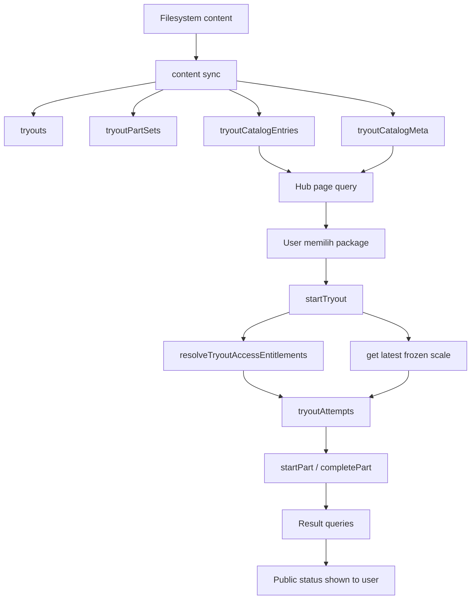
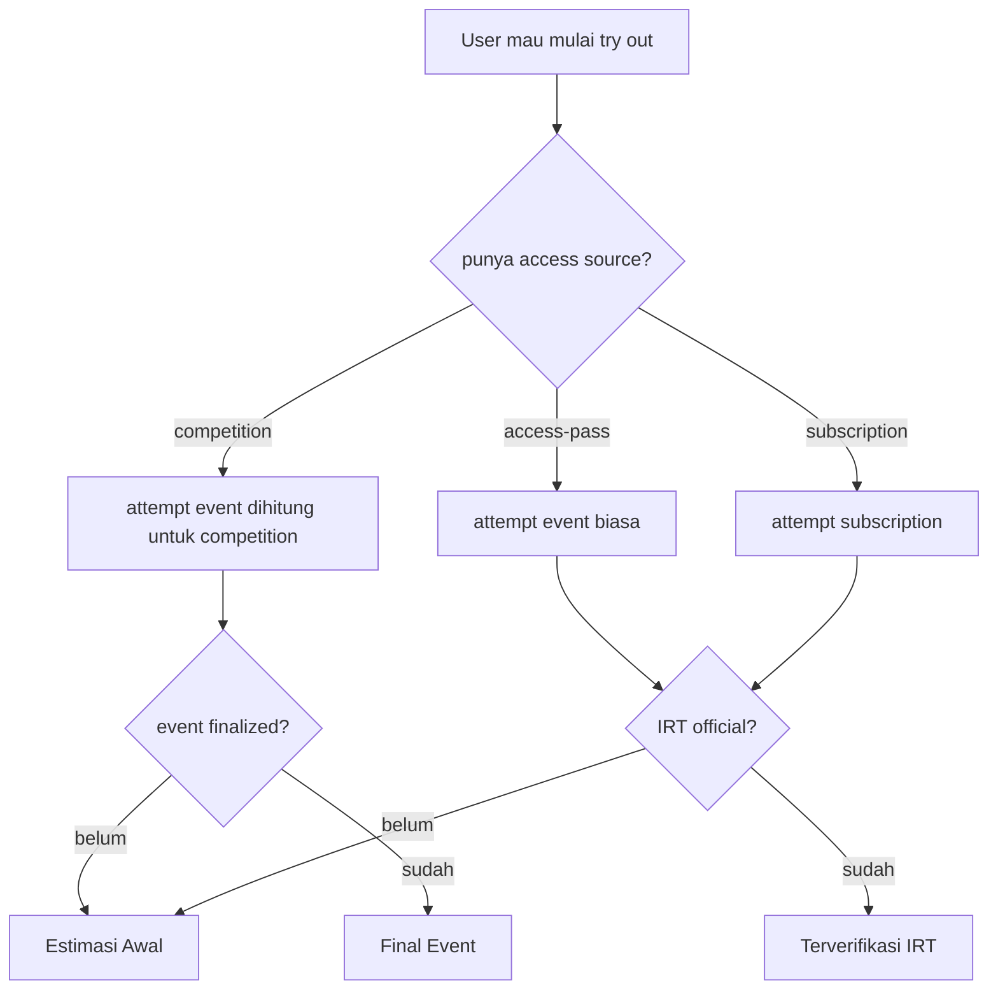

# Arsitektur Try Out Nakafa

Dokumen ini menjelaskan arsitektur try out Nakafa dengan bahasa yang bisa dibaca
oleh product, ops, support, dan engineering.

Dokumen ini tidak menggantikan source of truth teknikal. Ia merangkum bagaimana
sistem bekerja hari ini supaya orang tidak perlu membaca banyak file sekaligus.

Dokumen terkait:

- `../README.md`
- `./PRODUCT_POLICY.id.md`
- `../../irt/README.md`
- `../../irt/docs/EXPLAINER.id.md`
- `../../irt/docs/ARCHITECTURE.id.md`

## Ringkasan Singkat

Try out Nakafa sekarang dibagi menjadi empat lapisan besar:

- `contentSync/` mendeteksi try out dari content dan menyimpan katalog browse
- `tryoutAccess/` menentukan siapa yang boleh mulai
- `tryouts/` menjalankan lifecycle attempt dan membaca hasil
- `irt/` menjaga kualitas score internal dan publikasi frozen scale

Bahasa sederhananya:

- katalog try out dibentuk dari content yang sudah disync
- user melihat katalog itu di hub dan halaman produk
- saat user menekan mulai, backend menentukan sumber akses yang sah
- attempt lalu terkunci ke snapshot part dan frozen scale yang berlaku saat itu
- hasil publik yang dilihat user mengikuti policy produk, bukan sekadar status
  internal IRT

## Tujuan Desain

Arsitektur ini dibuat supaya:

- katalog hub bisa dipaginasi dengan benar tanpa scan penuh
- akses event dan Pro tidak saling menebak state satu sama lain
- attempt lama tetap stabil walaupun content berubah setelah sync
- kualitas psychometric tetap dipisah dari finalitas event
- dev dan prod bisa disegarkan ulang lewat sync yang sama

## Komponen Utama

### `contentSync/`

Tanggung jawab:

- mendeteksi try out dari `exerciseSets`
- menulis `tryouts` dan `tryoutPartSets`
- menulis read model katalog:
  - `tryoutCatalogEntries`
  - `tryoutCatalogMeta`

Artinya hub frontend tidak membaca seluruh `tryouts` lalu menyortir sendiri.
Urutan browse sudah dipersist ke katalog.

### `tryoutAccess/`

Tanggung jawab:

- membaca campaign dan link akses event
- menentukan entitlement aktif untuk `competition`, `access-pass`, atau Pro
- menyinkronkan status grant dan entitlement aktif
- menjaga state akses event tetap materialized lewat grant, entitlement, dan
  status campaign yang dischedule di Convex

Lapisan ini hanya menjawab pertanyaan:

> user ini boleh mulai dari jalur akses apa sekarang?

### `tryouts/`

Tanggung jawab:

- menyediakan query katalog hub
- menyediakan detail satu try out
- membuat dan melanjutkan attempt
- menyimpan snapshot part saat start
- menyimpan provenance akses attempt
- menampilkan hasil terakhir dan history attempt

Lapisan ini adalah runtime utama yang dilihat user.

### `irt/`

Tanggung jawab:

- menjaga frozen scale agar try out tetap startable
- mengkalibrasi item dari respons nyata
- memutuskan apakah hasil bisa naik menjadi `official`
- mempromosikan hasil lama saat official scale baru terbit

Lapisan ini tidak menentukan finalitas event. Ia menentukan kualitas
psychometric internal.

## Tabel Penting

### Katalog Browse

- `tryoutCatalogEntries`
  - satu baris kecil untuk satu kartu/package di hub
  - menyimpan `catalogSortKey` supaya pagination mengikuti urutan produk final
- `tryoutCatalogMeta`
  - menyimpan `activeCount` per `{product, locale}`
  - dipakai badge jumlah package tanpa scan penuh

### Definisi Try Out

- `tryouts`
  - definisi runtime satu try out
- `tryoutPartSets`
  - mapping part ke `exerciseSets`

### Runtime Attempt

- `tryoutAttempts`
  - lifecycle attempt level try out
- `tryoutPartAttempts`
  - lifecycle attempt level part yang menunjuk ke `exerciseAttempts`
- `userTryoutControls`
  - owner row per user untuk men-serialize `startTryout` lewat OCC
  - diverifikasi dan direpair lewat maintenance query/mutation bounded, bukan
    lewat fallback field tersembunyi di dokumen `users`
  - write path runtime mengasumsikan row ini sudah valid; kalau hilang atau
    duplikat, mutation gagal jelas sampai operator menjalankan repair

### Projection Akses

- `userTryoutEntitlements`
  - entitlement aktif per `{user, product, source}`
  - dipakai `startTryout` supaya read tetap exact dan bounded
- penggunaan competition dibaca langsung dari `tryoutAttempts`
  - exact read via index `{user, tryout, accessCampaignId, startedAt}`
  - tidak memakai projection claim terpisah
- saat user dihapus, runtime user-scoped ini ikut dibersihkan dalam batch
  bounded supaya tidak meninggalkan orphan rows

### Hasil dan Ranking

- `tryoutLeaderboardEntries`
  - best official result per user untuk namespace tertentu
- `userTryoutStats`
  - agregat personal untuk leaderboard/product

## Journey User

### 1. User membuka hub try out

- server membaca `getActiveTryoutCatalogSnapshot`
- client membaca `getActiveTryoutCatalogPage` dengan `usePaginatedQuery`
- kalau user login, page query menggabungkan latest-attempt badge untuk row yang
  sedang dimuat
- setiap page sudah datang dalam urutan final yang benar
- jika user login, badge row datang langsung bersama row katalog di page aktif

### 2. User membuka halaman detail try out

- backend membaca `getTryoutDetails`
- halaman ini memakai slug runtime yang sudah dideteksi saat sync

### 3. User menekan mulai

- `startTryout` memverifikasi auth
- backend membaca satu entitlement aktif per source:
  - `competition`
  - `access-pass`
  - Pro subscription
- runtime tidak menghitung ulang access aktif dari clock; scheduler exact dan
  repair bounded menjaga projection entitlement tetap authoritative
- backend men-touch tepat satu `userTryoutControls` row yang sudah harus ada
  sebagai batas OCC khusus `startTryout`
- kalau ada entitlement `competition`, backend membaca satu attempt indexed untuk
  `{user, tryout, campaign}`
- backend memilih access source yang sah sesuai policy produk
- backend mengikat attempt ke frozen scale terbaru yang aman dipakai
- backend menyimpan snapshot part dan provenance akses

### 4. User mengerjakan per part

- route part membaca state runtime dengan auth server-side bila token tersedia
- `startPart` memakai snapshot yang sudah disimpan saat attempt dibuat
- set slug, timer, dan jumlah soal dibaca dari snapshot/runtime mapping, bukan
  dari definisi static try out saat ini
- `completePart` menyimpan score part

### 5. User melihat hasil

- hasil terbaru dibaca dari `queries/me/attempt.ts`
- history attempt dibaca dari `queries/me/history.ts`
- label publik mengikuti policy:
  - `Estimasi Awal`
  - `Terverifikasi IRT`
  - `Final Event`

## Alur Data End To End

## Alur Akses dan Result

Result competition tidak punya state runtime `finalizing`.

- scheduler exact di `endsAt` langsung menjalankan finalizer internal
- cron sweep hanya mem-finalkan competition `pending` yang sudah overdue
- akibatnya model storage cukup `pending` atau `finalized`

## Kenapa Katalog Punya Tabel Sendiri?

Karena hub butuh tiga hal sekaligus:

- urutan final yang stabil
- exact count untuk badge
- pagination yang bounded dan murah

Kalau hub membaca `tryouts` langsung lalu menyortir setelah query:

- caller harus memuat semua page dulu
- count badge butuh scan penuh atau workaround
- urutan final tidak hidup di storage layer

Dengan `tryoutCatalogEntries` dan `tryoutCatalogMeta`:

- query Convex sudah sesuai kebutuhan UI
- hub bisa paginasi page per page
- count tetap exact tanpa scan besar

## Frontend Contract

Hub dan halaman produk sekarang mengikuti kontrak ini:

- server component:
  - baca translations
  - baca `getActiveTryoutCatalogSnapshot`
- client component:
  - baca `getActiveTryoutCatalogPage` dengan `usePaginatedQuery`
  - group by `cycleKey`
  - load more dengan `Intersection`

Halaman part runtime mengikuti kontrak berbeda:

- page server membaca `getTryoutDetails`
- jika user login, page juga membaca `queries/me/part.ts` dengan token server-side
- file content dibaca dari `setSlug` runtime yang sudah resolve dari snapshot
- route ini sengaja dynamic karena bergantung pada auth, expiry, dan snapshot
  attempt user

Artinya:

- path lama yang menghabiskan semua page di Next server sudah tidak dipakai lagi
- query katalog global hanya menambahkan latest-attempt badge untuk row pada page
  aktif

## Checklist Ops Dan Engineering

Kalau schema atau write path try out berubah:

1. deploy backend Convex
2. jalankan sync fresh di dev
3. verifikasi katalog dan integrity IRT
4. jalankan sync fresh di prod
5. verifikasi lagi di prod

Perintah penting:

- `pnpm --filter @repo/backend sync`
- `pnpm --filter @repo/backend sync:prod`
- `pnpm --filter @repo/backend irt:verify:cache`
- `pnpm --filter @repo/backend irt:verify:scale`
- `pnpm --filter @repo/backend irt:prod:verify:cache`
- `pnpm --filter @repo/backend irt:prod:verify:scale`

## Pertanyaan Yang Sering Salah Dipahami

### Apakah hub membaca semua try out sekaligus?

Tidak. Hub membaca meta count kecil dan page katalog kecil.

### Apakah status badge hub membaca semua package status sekaligus?

Tidak. Hub membaca satu ringkasan kecil per user lalu mencocokkannya ke slug row
yang sedang tampil.

### Apakah competition campaign boleh overlap untuk product yang sama?

Tidak. Satu product hanya boleh punya satu competition campaign aktif pada satu
window waktu.

### Apakah `Final Event` sama dengan `official`?

Tidak. `Final Event` adalah finalitas produk event. `official` adalah finalitas
IRT internal.

### Apakah content sync hanya membuat definisi try out?

Tidak. Content sync juga mengisi read model katalog yang dipakai frontend.
