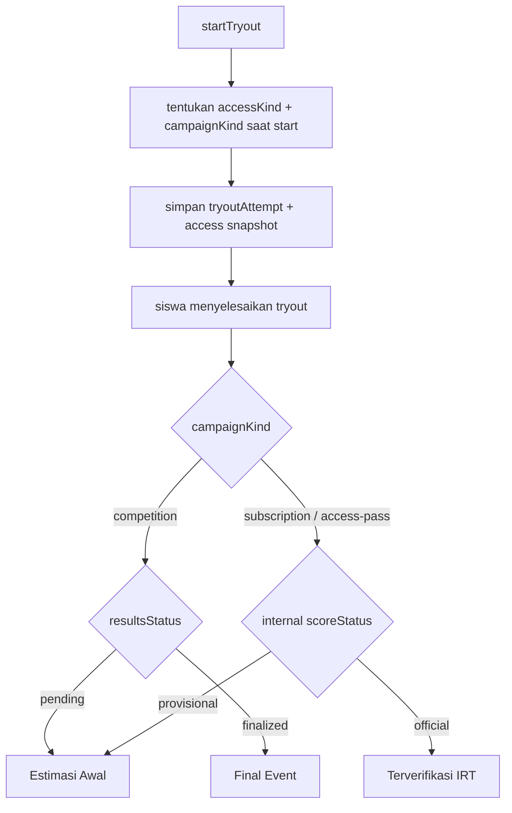

# Product Policy Try Out Nakafa

Dokumen ini mendefinisikan policy produk yang jelas untuk status nilai try out,
khususnya saat satu try out bisa diakses lewat dua jalur berbeda:

- event access
- Nakafa Pro

Dokumen ini menjelaskan policy produk yang sekarang menjadi acuan implementasi
runtime:

- campaign akses dibagi menjadi `competition` dan `access-pass`
- provenance akses attempt disimpan saat `startTryout`
- status publik siswa memakai **satu label utama** saja

Dokumen teknikal yang relevan:

- `../README.md`
- `../../irt/README.md`
- `../../irt/docs/EXPLAINER.id.md`

## Tujuan Policy

Policy ini dibuat supaya:

- sistem psychometric tetap jujur
- siswa tidak bingung melihat status nilai
- hasil event bisa ditutup dengan jelas
- user Pro tidak ikut terkena logika event secara tidak sengaja
- tim produk, ops, dan engineering memakai istilah yang sama

## Prinsip Inti

1. status internal psychometric dan status publik tidak boleh dicampur
2. event selesai tidak otomatis berarti hasil IRT menjadi `official`
3. attempt harus menyimpan sumber akses saat start, jangan menebak belakangan
4. hasil event boleh final untuk kebutuhan event, walaupun internal IRT belum
   `official`
5. user Pro tidak boleh mendapatkan label event kalau attempt-nya bukan attempt
   event

## Istilah Yang Dipakai

### Status internal backend

- `provisional`
  - hasil masih memakai frozen scale yang belum lolos full quality gate
- `official`
  - hasil sudah memakai frozen scale yang lolos quality gate IRT

### Status publik yang dilihat siswa

- `Estimasi Awal`
  - hasil awal yang masih bisa berubah setelah verifikasi IRT
- `Terverifikasi IRT`
  - hasil sudah lolos verifikasi IRT
- `Final Event`
  - hasil event sudah ditutup/final untuk kebutuhan event, walaupun internal IRT
    belum tentu `official`

## Aturan Emas

`Final Event` bukan sinonim dari `official`.

- `official` = resmi secara psychometric IRT
- `Final Event` = final untuk kebutuhan event/kompetisi

## Jenis Campaign

### `competition`

Dipakai untuk event yang harus punya hasil final saat event ditutup.

Aturan runtime:

- redeem hanya saat campaign aktif
- competition campaign untuk product yang sama tidak boleh overlap
- `startsAt`, `endsAt`, `products`, dan `grantDurationDays` tidak boleh diubah
  setelah campaign pernah diredeem
- event close adalah cutoff final event
- setelah event close:
  - tidak bisa redeem
  - tidak bisa start attempt baru dari event
  - tidak bisa resume attempt event yang masih berjalan
- attempt pertama yang berasal dari event adalah attempt yang dihitung untuk
  event

### `access-pass`

Dipakai untuk promo / marketing / grant akses biasa.

Aturan runtime:

- redeem hanya saat campaign aktif
- setelah redeem, user punya window akses sendiri sesuai `grantDurationDays`
- campaign end hanya menutup redeem baru
- hasil publik tetap mengikuti verifikasi IRT biasa

## Sumber Akses Yang Harus Disimpan

Saat `startTryout`, attempt harus menyimpan provenance akses.

Field yang disimpan di `tryoutAttempts`:

- `accessKind: "event" | "subscription"`
- `accessCampaignId?: Id<"tryoutAccessCampaigns">`
- `accessCampaignKind?: "competition" | "access-pass"`
- `accessGrantId?: Id<"tryoutAccessGrants">`
- `accessEndsAt?: number`
- `countsForCompetition?: boolean`

Kalau user punya event grant dan Pro sekaligus, sistem tidak boleh menebak dari
state saat ini. Sumber akses attempt harus ditentukan saat attempt dibuat.

## Decision Matrix Status Publik

### Attempt non-competition

Ini mencakup:

- attempt berbasis subscription / Nakafa Pro
- attempt berbasis `access-pass`

| Kondisi internal | Status publik |
|------|------|
| `provisional` | `Estimasi Awal` |
| `official` | `Terverifikasi IRT` |

`Final Event` tidak dipakai untuk flow ini.

### Attempt berbasis `competition`

| Kondisi event | Status publik |
|------|------|
| event belum difinalkan | `Estimasi Awal` |
| event sudah difinalkan | `Final Event` |

Artinya, untuk competition user tidak melihat badge `Terverifikasi IRT` sebagai
label utama. Verifikasi IRT tetap boleh berjalan di background, tetapi finalitas
publiknya tetap mengikuti finalitas event.

## Decision Matrix Akses

| Kondisi user | Bisa start attempt baru? | Bisa resume attempt aktif? |
|------|------|------|
| `competition` masih aktif dan belum pernah pakai attempt event | ya | ya |
| `competition` sudah pernah pakai attempt event | tidak, kecuali punya akses non-event lain | ya, sampai event close |
| `competition` sudah berakhir | tidak | tidak |
| `access-pass` masih aktif | ya | ya |
| Pro aktif | ya | ya |
| tidak punya akses sama sekali | tidak | hanya kalau attempt non-competition lama masih aktif |

Catatan penting:

- `competition` memakai `expiresAt = min(tryoutWindow, campaign.endsAt)`
- `access-pass` dan subscription memakai expiry tryout normal

## Flow Yang Direkomendasikan

## Policy Untuk User Yang Punya Event Dan Pro Sekaligus

- source akses attempt harus eksplisit saat start
- satu attempt hanya punya satu `accessKind`
- jangan tentukan `accessKind` dari status yang berubah setelah attempt dibuat

Aturan runtime yang dipakai:

- kalau ada grant `competition` aktif dan user belum punya counted attempt untuk
  tryout itu, attempt baru diambil sebagai `event`
- setelah counted attempt competition sudah ada, start baru hanya boleh memakai
  akses non-event lain seperti Pro atau `access-pass`

## Policy Untuk Hasil Setelah Event Ditutup

### Yang direkomendasikan

- hasil publik competition ditutup saat event berakhir
- internal IRT tetap boleh lanjut membaik di background
- badge utama competition tetap `Final Event`

### Yang tidak direkomendasikan

- jangan ubah label event menjadi `official` hanya karena event selesai
- jangan paksa event close menjadi shortcut untuk melompati quality gate IRT

## Policy Untuk Siswa Yang Sudah Selesai, Tapi Bukan Pro Lagi

Kalau siswa:

- sudah punya attempt
- lalu access event habis
- dan dia bukan Nakafa Pro

Maka policy yang direkomendasikan:

- dia tidak bisa start attempt baru
- dia masih bisa melihat hasil lama
- kalau attempt lama berbasis competition dan event sudah tutup, dia tidak bisa
  resume lagi
- kalau attempt lama non-competition masih in-progress, dia masih bisa resume
- kalau backend nanti mempromosikan hasil `provisional -> official`, histori
  nilainya tetap bisa ikut diperbarui

## Policy Komunikasi Ke Client

> Sistem Nakafa memisahkan hasil final event dari verifikasi IRT. Event
> competition bisa ditutup dengan hasil final yang jelas, sementara verifikasi
> IRT tetap berjalan konservatif di belakang layar.

## Policy Komunikasi Ke Siswa

### `Estimasi Awal`

> Nilai ini adalah estimasi awal dan belum menjadi hasil final untuk event atau
> verifikasi IRT.

### `Terverifikasi IRT`

> Nilai ini sudah lolos verifikasi IRT dan menjadi hasil resmi untuk flow
> non-competition.

### `Final Event`

> Hasil competition ini sudah final. Verifikasi IRT lanjutan, jika ada, tidak
> mengubah hasil final event yang dilihat siswa.

## Policy Untuk Attempt Lama

Attempt lama yang belum punya snapshot provenance tidak boleh dipaksa ditebak.

Fallback yang direkomendasikan:

- `official` -> `Terverifikasi IRT`
- `provisional` -> `Estimasi Awal`

Artinya `Final Event` hanya dipakai untuk attempt baru yang provenance-nya jelas.

## Referensi

- Yen, W. M., & Fitzpatrick, A. R. (2006). *Item Response Theory*.
  https://www.ets.org/research/policy_research_reports/publications/chapter/2006/hsll.html
- Bock, R. D., & Mislevy, R. J. (1982). Adaptive EAP estimation of ability in a
  microcomputer environment.
  https://doi.org/10.1177/014662168200600405
- Chalmers, R. P. (2012). `mirt`: A Multidimensional Item Response Theory
  Package for the R Environment.
  https://doi.org/10.18637/jss.v048.i06
