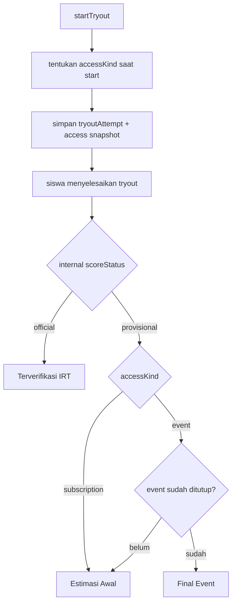

# Product Policy Try Out Nakafa

Dokumen ini mendefinisikan policy produk yang jelas untuk status nilai try out,
khususnya saat satu try out bisa diakses lewat dua jalur berbeda:

- event access
- Nakafa Pro

Dokumen ini adalah **target policy produk yang direkomendasikan**. Beberapa
bagian sudah sejalan dengan runtime saat ini, tetapi provenance akses event vs
subscription belum seluruhnya dipersist di kode sekarang.

Dokumen teknikal yang relevan:

- `../README.md`
- `../../irt/README.md`
- `../../irt/docs/EXPLAINER.id.md`

## Tujuan Policy

Policy ini dibuat supaya:

- sistem psychometric tetap jujur
- siswa tidak bingung melihat status nilai
- hasil event bisa ditutup dengan jelas
- user Pro tidak ikut terkena logika event secara tidak sengaja
- tim produk, ops, dan engineering memakai istilah yang sama

## Prinsip Inti

1. status internal psychometric dan status publik tidak boleh dicampur
2. event selesai tidak otomatis berarti hasil IRT menjadi `official`
3. attempt harus menyimpan sumber akses saat start, jangan menebak belakangan
4. hasil event boleh final untuk kebutuhan event, walaupun internal IRT belum
   `official`
5. user Pro tidak boleh mendapatkan label event kalau attempt-nya bukan attempt
   event

## Istilah Yang Dipakai

### Status internal backend

- `provisional`
  - hasil masih memakai frozen scale yang belum lolos full quality gate
- `official`
  - hasil sudah memakai frozen scale yang lolos quality gate IRT

### Status publik yang dilihat siswa

- `Estimasi Awal`
  - hasil awal yang masih bisa berubah setelah verifikasi IRT
- `Terverifikasi IRT`
  - hasil sudah lolos verifikasi IRT
- `Final Event`
  - hasil event sudah ditutup/final untuk kebutuhan event, walaupun internal IRT
    belum tentu `official`

## Aturan Emas

`Final Event` bukan sinonim dari `official`.

- `official` = resmi secara psychometric IRT
- `Final Event` = final untuk kebutuhan event/kompetisi

## Sumber Akses Yang Harus Disimpan

Saat `startTryout`, attempt harus menyimpan provenance akses.

Field yang direkomendasikan di `tryoutAttempts`:

- `accessKind: "event" | "subscription"`
- `accessCampaignId?: Id<"tryoutAccessCampaigns">`
- `accessGrantId?: Id<"tryoutAccessGrants">`

Kalau user punya event grant dan Pro sekaligus, sistem tidak boleh menebak dari
state saat ini. Sumber akses attempt harus ditentukan saat attempt dibuat.

## Decision Matrix Status Publik

### Attempt berbasis subscription / Nakafa Pro

| Kondisi internal | Status publik |
|------|------|
| `provisional` | `Estimasi Awal` |
| `official` | `Terverifikasi IRT` |

User Pro tidak pernah memakai `Final Event`.

### Attempt berbasis event

| Kondisi internal | Event masih berjalan? | Status publik |
|------|------|------|
| `provisional` | ya | `Estimasi Awal` |
| `provisional` | tidak | `Final Event` |
| `official` | ya | `Terverifikasi IRT` |
| `official` | tidak | `Terverifikasi IRT` |

## Decision Matrix Akses

| Kondisi user | Bisa start attempt baru? | Bisa resume attempt aktif? |
|------|------|------|
| event aktif | ya | ya |
| Pro aktif | ya | ya |
| event berakhir, bukan Pro | tidak | ya, selama attempt lama belum expired |
| Pro habis, bukan event | tidak | ya, selama attempt lama belum expired |
| tidak punya akses sama sekali | tidak | hanya kalau attempt lama masih aktif dan belum expired |

Catatan penting:

- start attempt baru memakai access check saat ini
- resume attempt lama bergantung pada status attempt yang sudah ada, bukan harus
  punya akses baru lagi

## Flow Yang Direkomendasikan

## Policy Untuk User Yang Punya Event Dan Pro Sekaligus

- source akses attempt harus eksplisit saat start
- satu attempt hanya punya satu `accessKind`
- jangan tentukan `accessKind` dari status yang berubah setelah attempt dibuat

Rekomendasi UX:

- kalau user masuk dari halaman / kode event, attempt dibuat sebagai `event`
- kalau user mulai dari jalur normal subscriber, attempt dibuat sebagai
  `subscription`

## Policy Untuk Hasil Setelah Event Ditutup

### Yang direkomendasikan

- hasil publik event boleh ditutup saat event berakhir
- internal IRT tetap boleh lanjut membaik di background
- promosi `provisional -> official` boleh tetap terjadi untuk histori personal

### Yang tidak direkomendasikan

- jangan ubah label event menjadi `official` hanya karena event selesai
- jangan paksa event close menjadi shortcut untuk melompati quality gate IRT

## Policy Untuk Siswa Yang Sudah Selesai, Tapi Bukan Pro Lagi

Kalau siswa:

- sudah punya attempt
- lalu access event habis
- dan dia bukan Nakafa Pro

Maka policy yang direkomendasikan:

- dia tidak bisa start attempt baru
- dia masih bisa melihat hasil lama
- kalau attempt lama masih in-progress dan belum expired, dia masih bisa resume
- kalau backend nanti mempromosikan hasil `provisional -> official`, histori
  nilainya tetap bisa ikut diperbarui

## Policy Komunikasi Ke Client

> Sistem Nakafa tetap bisa menjalankan try out dan menghitung nilai awal meski
> partisipasi belum besar. Namun, status resmi IRT memang dibuat konservatif.
> Karena itu, untuk kebutuhan event kami membedakan antara hasil final event dan
> hasil yang sudah terverifikasi IRT.

## Policy Komunikasi Ke Siswa

### `Estimasi Awal`

> Nilai ini adalah estimasi awal dan dapat diperbarui setelah verifikasi IRT
> selesai.

### `Terverifikasi IRT`

> Nilai ini sudah lolos verifikasi IRT dan menjadi hasil resmi.

### `Final Event`

> Hasil event ini sudah final. Verifikasi IRT lanjutan, jika ada, tidak
> memengaruhi hasil event.

## Policy Untuk Attempt Lama

Attempt lama yang belum punya snapshot provenance tidak boleh dipaksa ditebak.

Fallback yang direkomendasikan:

- `official` -> `Terverifikasi IRT`
- `provisional` -> `Estimasi Awal`

Artinya `Final Event` hanya dipakai untuk attempt baru yang provenance-nya jelas.

## Referensi

- Yen, W. M., & Fitzpatrick, A. R. (2006). *Item Response Theory*.
  https://www.ets.org/research/policy_research_reports/publications/chapter/2006/hsll.html
- Bock, R. D., & Mislevy, R. J. (1982). Adaptive EAP estimation of ability in a
  microcomputer environment.
  https://doi.org/10.1177/014662168200600405
- Chalmers, R. P. (2012). `mirt`: A Multidimensional Item Response Theory
  Package for the R Environment.
  https://doi.org/10.18637/jss.v048.i06
