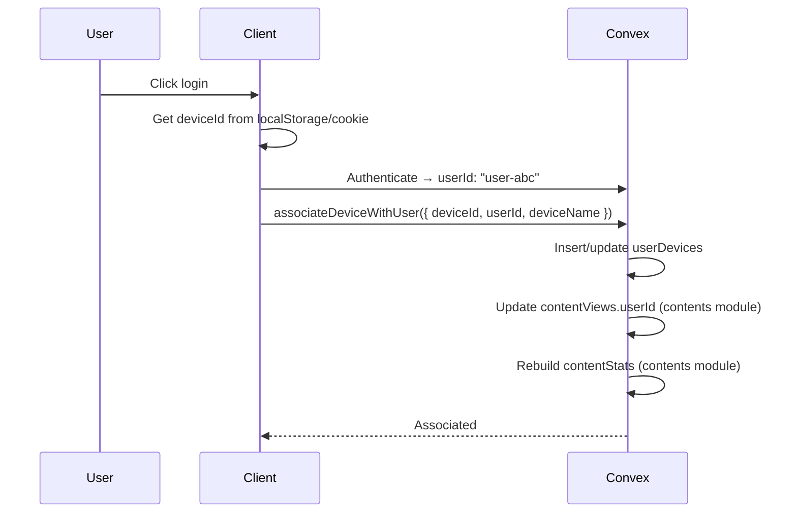
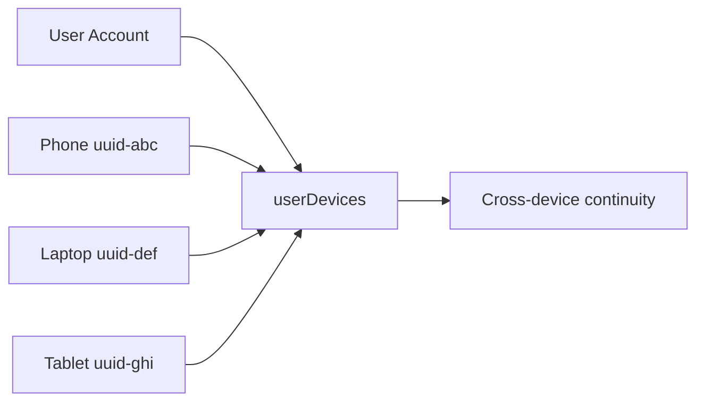
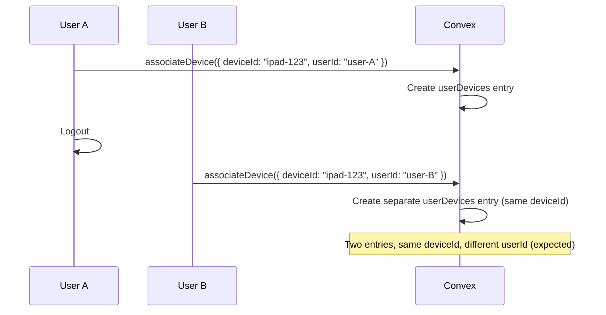
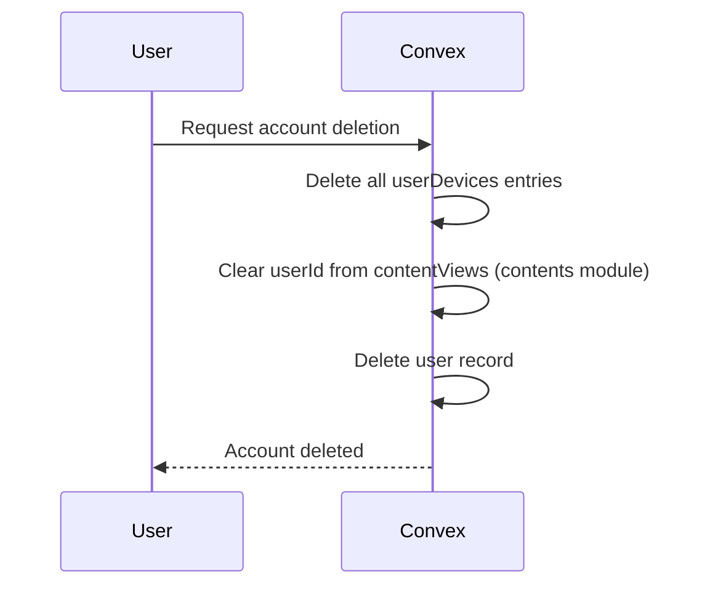

# Users Module

Manage user accounts and device tracking.

## Flows

### Device Association on Login

### Multi-Device Management

### Shared Device (Multiple Users)

### Account Deletion (GDPR)

## Edge Cases

| Case | Solution |
| ------ | ---------- |
| New user with existing device | Associate existing deviceId with new userId |
| Shared device (family) | Separate `userDevices` entries per user |
| Device inactivity (>30 days) | Mark `isActive: false` via scheduled job |
| Device name collision | Add auto-generated suffix (e.g., "iPhone 2") |

## Schema Notes

- `users`: Synced from Better Auth (email, authId, name, image, role)
- `userDevices`: Track all devices linked to user (deviceId, deviceName, lastSeenAt, isActive)
