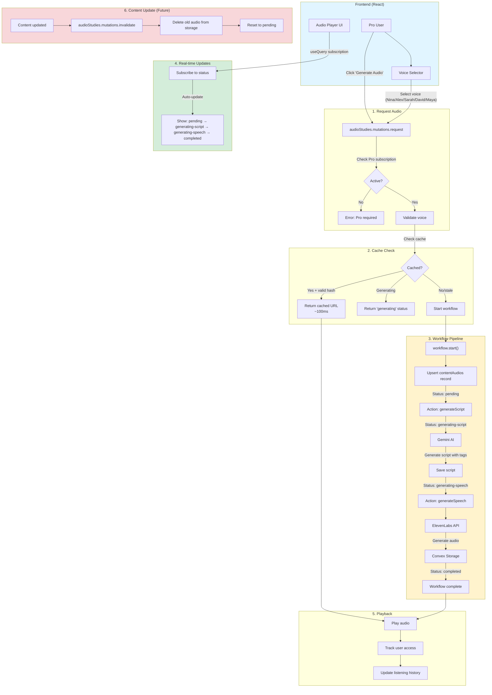

# Audio Studies Feature

Enable Pro users to generate podcast-style audio from educational content using ElevenLabs.

## Architecture
- **Shared cache**: One audio per content+voice (minimize costs)
- **Auto-regeneration**: Content updates invalidate cache
- **Real-time**: Convex subscriptions for status updates
- **5 voices**: Nina (default), Alex, Sarah, David, Maya

## End-to-End User Flow



## Implementation

**See `IMPLEMENTATION.md` for complete implementation guide.**

## Files to Create

```
packages/ai/config/voices.ts                      # Voice configurations
packages/backend/convex/audioStudies/             # Main feature folder
├── schema.ts                                     # Database tables
├── queries.ts                                    # Public + internal queries  
├── mutations.ts                                  # Public + internal mutations
├── actions.ts                                    # AI generation
└── workflows.ts                                  # Orchestration
packages/backend/convex/articleContents/queries.ts    # Add getById
packages/backend/convex/subjectSections/queries.ts    # Add getById
```

## Status Flow
```
pending → generating-script → generating-speech → completed
                              ↓
                            failed
```

## Key Decisions
- ✅ Kebab-case status values (`generating-script` not `generating_script`)
- ✅ Store voice settings per audio (future-proof)
- ✅ No api.ts - mix public/internal in queries/mutations
- ✅ No unused functions - only what we need
- ✅ Content queries in their respective folders
- ✅ Uses AI SDK (not ElevenLabs SDK directly)

## Commands
```bash
pnpm typecheck
pnpm lint
```
