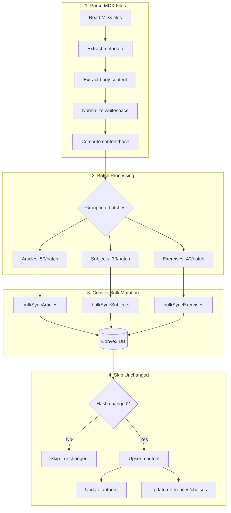
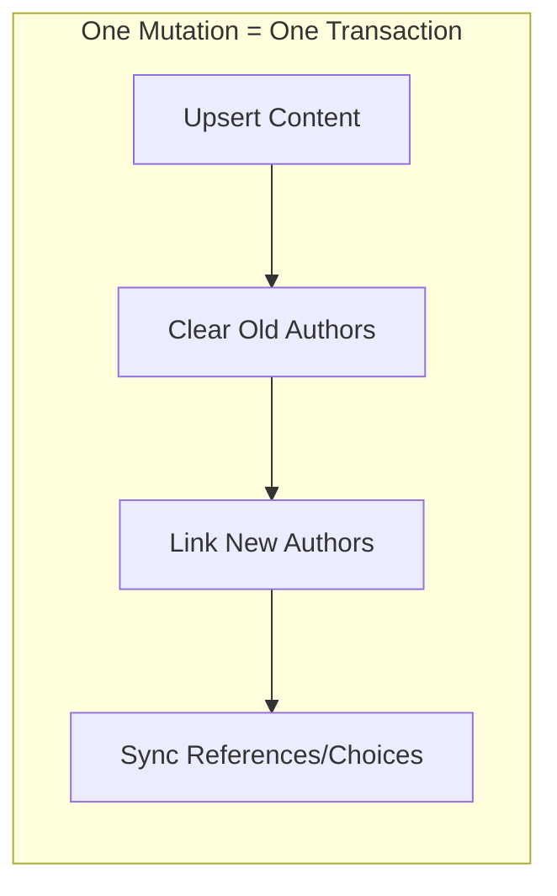
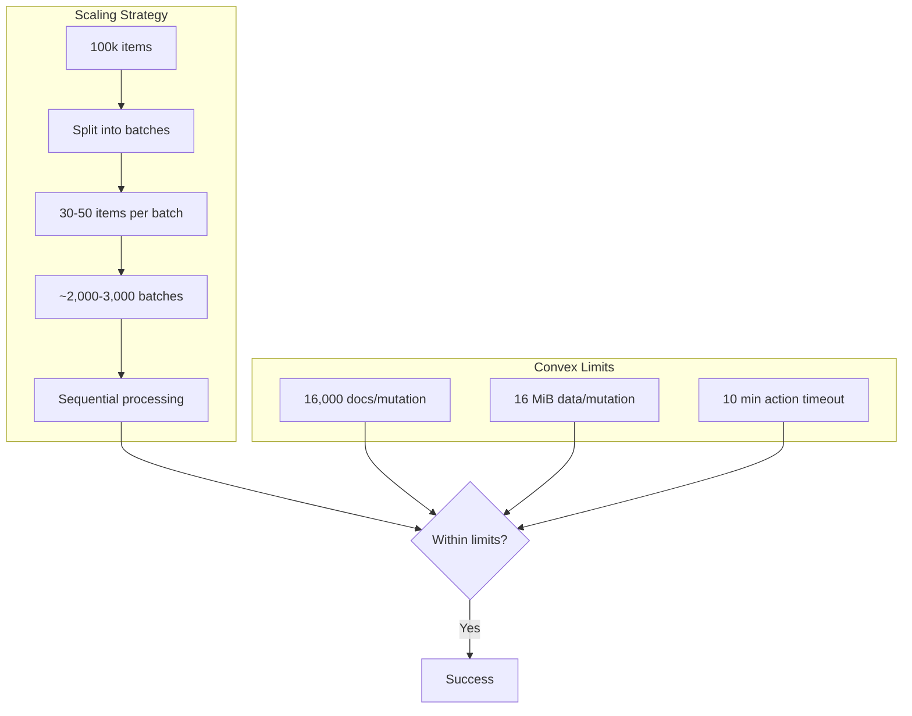

# Content Sync Guide

Sync MDX content from filesystem to Convex database.

## Quick Start

```bash
# Sync everything
pnpm --filter backend sync:all

# Sync specific content type
pnpm --filter backend sync:articles
pnpm --filter backend sync:subjects
pnpm --filter backend sync:exercises

# Preview changes without syncing
pnpm --filter backend sync:all -- --dry-run

# Sync specific locale only
pnpm --filter backend sync:subjects -- --locale en
```

## How It Works



## Architecture

### Content Hash Strategy

Each content item has a `contentHash` computed from:

| Content Type | Hash Includes |
|-------------|---------------|
| Articles | `body + references + authors` |
| Subjects | `body + authors` |
| Exercises | `questionBody + answerBody + choices + authors` |

This ensures:
- Body changes trigger re-sync
- Author changes trigger re-sync
- Reference/choice changes trigger re-sync
- Unchanged content is skipped (fast!)

### Bulk Mutations (Single Transaction)

Each batch runs as a single Convex mutation, handling:



Benefits:
- Atomic: all-or-nothing per batch
- Fast: single round-trip to database
- Consistent: no partial updates

## Scalability

### Current Stats

| Content Type | Files | Batches | Time |
|-------------|-------|---------|------|
| Articles | 14 | 1 | ~2s |
| Subjects | 606 | 21 | ~30s |
| Exercises | 920 | 23 | ~35s |

### Scaling to 100,000+ Items

The system is designed to scale:



**Why it scales:**

1. **Batch size is conservative**
   - 30-50 items per batch
   - Well under 16,000 doc limit
   - Well under 16 MiB data limit

2. **Hash-based skipping**
   - Only changed content syncs
   - 100k items with 1% changes = only 1k syncs

3. **Sequential batches**
   - No memory explosion
   - Predictable progress
   - Can resume from failure

### Estimated Time at Scale

| Items | Changed | Batches | Est. Time |
|-------|---------|---------|-----------|
| 10,000 | 100% | 300 | ~5 min |
| 10,000 | 10% | 30 | ~30 sec |
| 100,000 | 100% | 3,000 | ~50 min |
| 100,000 | 1% | 30 | ~30 sec |

Daily incremental syncs (1-5% changes) stay fast even at scale.

## File Structure

```
packages/backend/
├── scripts/
│   ├── sync-content.ts      # CLI entry point
│   └── lib/
│       └── mdxParser.ts     # MDX parsing utilities
└── convex/
    └── contentSync/
        └── mutations.ts     # Bulk sync mutations
```

## Convex Best Practices Applied

### 1. Bulk Operations in Single Mutation

From [Convex Best Practices](https://docs.convex.dev/understanding/best-practices):

> "Perform batch inserts via a single mutation"

Our bulk mutations handle entire batches in one transaction:

```typescript
// Good: Single mutation for batch
export const bulkSyncSubjects = internalMutation({
  handler: async (ctx, { subjects }) => {
    for (const subject of subjects) {
      // All operations in same transaction
      await ctx.db.insert(...);
      await ctx.db.insert(...); // authors
    }
  }
});
```

### 2. Internal Mutations for Scripts

> "Use internal functions for backend-only operations"

All sync mutations are `internalMutation` - not exposed to clients:

```typescript
import { internalMutation } from "@repo/backend/convex/functions";

export const bulkSyncArticles = internalMutation({
  // Only callable via CLI or scheduled jobs
});
```

### 3. Efficient Indexes

Each content table has `locale_slug` index for fast lookups:

```typescript
.index("locale_slug", ["locale", "slug"])
```

### 4. Normalized Schema

Following Convex recommendation to keep arrays small:
- Authors in separate table (not embedded array)
- References in separate table
- Choices in separate table

## Troubleshooting

### Sync is slow

Check how many items are being updated vs unchanged:

```bash
pnpm --filter backend sync:all
# Look for "Updated: X, Unchanged: Y"
```

If most items update every time:
- Check if `contentHash` is computed consistently
- Verify metadata isn't changing unexpectedly

### Memory issues with large batches

Reduce batch size in `sync-content.ts`:

```typescript
const BATCH_SIZE_SUBJECTS = 20; // Reduce from 30
```

### CLI argument too large

If you see `SIGSEGV` or argument errors:
- Batch size is too large for CLI args
- Content bodies are very large
- Reduce batch size

## Adding New Content Types

1. Create schema in `convex/<type>/schema.ts`
2. Add bulk mutation in `convex/contentSync/mutations.ts`
3. Add sync function in `scripts/sync-content.ts`
4. Add npm script in `package.json`

---

**Last Updated**: January 24, 2026
